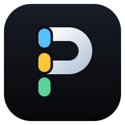
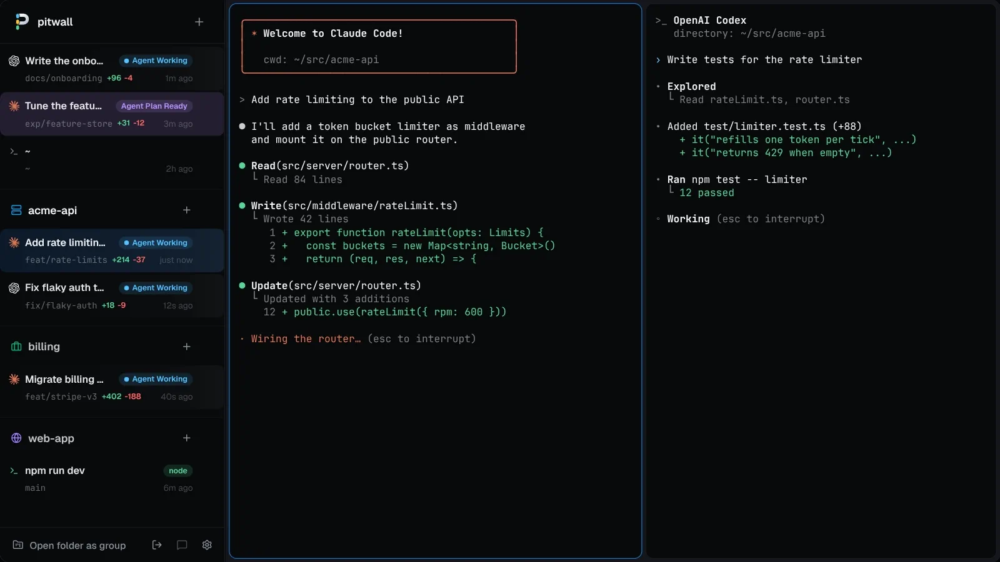
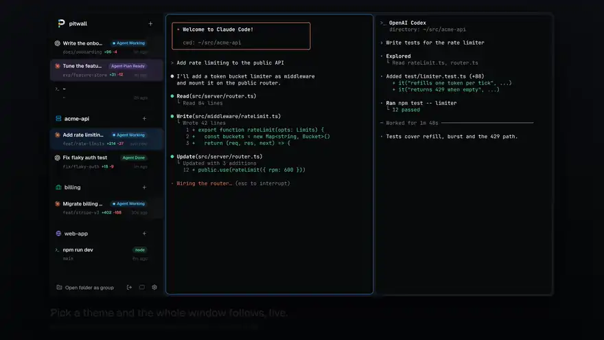

# pitwall




pitwall is a terminal multiplexer for running coding agents side by side. It
opens straight into a shell like tmux, but it is a native window: a sidebar
lists every tab and what it is doing right now, whether that is a command
running in a terminal or a Claude Code, Codex or pi agent working, waiting for
your answer, asking for approval, done, or failed. Terminals are drawn with
real fonts and pixels, not character cells.

A background daemon owns every terminal. Closing the window leaves tabs
running, and after a reboot they come back in the same folders with agents
resumed where they left off.

**pitwall is in alpha.** It is used every day on Linux, but expect rough
edges, and config or saved state may change between releases. It is
developed on Linux (Hyprland) and works on any Wayland or X11 desktop.
macOS and Windows builds are new; see the notes below. Releases are tagged
`v0.1.0-alpha.N`.

## Install

On Linux or macOS:

```sh
curl -fsSL https://raw.githubusercontent.com/quanticstudios/pitwall/main/scripts/get.sh | sh
```

On Windows, in PowerShell:

```powershell
irm https://raw.githubusercontent.com/quanticstudios/pitwall/main/scripts/get.ps1 | iex
```

The script downloads the latest release for your system, checks it against
the release's `checksums.txt`, and installs `pitwall` in `~/.local/bin`. On
Windows it installs `pitwall.exe` in `%LOCALAPPDATA%\pitwall\bin` and adds that
folder to your user PATH. To pin a release, set `PITWALL_VERSION=v0.1.0-alpha.1`; to
install somewhere else, set `PITWALL_INSTALL_DIR`. In PowerShell, set them
first with `$env:PITWALL_VERSION = 'v0.1.0-alpha.1'`.

| Platform                       | Release builds | Status                     |
| ------------------------------ | -------------- | -------------------------- |
| Linux (glibc 2.35 or newer)    | x86_64, arm64  | alpha, used every day      |
| macOS                          | arm64, x86_64  | alpha, new and not yet run |
| Windows 10 1809 or newer, 11   | x86_64, arm64  | alpha, new and not yet run |

The macOS and Windows builds compile and pass the platform-independent tests
in CI, but nobody has used them yet. Expect rough edges, and please report
what breaks.

Known gaps on macOS:

- Release binaries are not signed. `get.sh` clears the quarantine flag; for an
  archive you downloaded yourself, run `xattr -d com.apple.quarantine pitwall`.
- There is no app bundle or Dock icon yet. Start pitwall from a terminal.
- Notifications come through `osascript`, so macOS shows them under Script
  Editor.

Known gaps on Windows:

- Agent status comes from hooks only. Windows has no foreground process group
  to read, so an agent started without hooks, or a command running in a
  shell, shows nothing in the sidebar.
- A tab's folder does not follow `cd`. It stays the folder the tab opened in.
- There is no Start menu entry. Run `pitwall` from a terminal; started from
  Explorer, a console window flashes before the window opens.
- Claude Code runs hook commands through Git Bash. Other shells get a path
  with forward slashes, quoted only when it contains spaces.
- When an upgrade replaces a running daemon, the old daemon is stopped without
  a final save. It saves within moments of every change, so little is lost.

The Linux release archive holds only the binary. For a desktop entry and
icon, build from source as below.

### Build from source

You need Git, a C compiler, pkg-config, and [mise](https://mise.jdx.dev). Gio,
the UI toolkit, needs the development headers for EGL, Wayland, X11,
xkbcommon, Xcursor and Xfixes (`egl`, `wayland-egl`, `wayland-client`,
`wayland-cursor`, `x11`, `x11-xcb`, `xkbcommon`, `xkbcommon-x11`, `xcursor`,
`xfixes` in pkg-config).

```sh
git clone https://github.com/quanticstudios/pitwall.git
cd pitwall
mise install go
./scripts/install.sh
```

The installer builds `~/.local/bin/pitwall` and adds a desktop entry and icon
under `~/.local/share`, so pitwall shows up in your app launcher. Set `PREFIX`
to install elsewhere. It never edits Claude Code or Codex configuration.

Check the install:

```sh
pitwall --version
```

## Quick start

```sh
pitwall hooks install --dry-run   # see what would change
pitwall hooks install             # let Claude Code, Codex and pi report their state
pitwall                           # open the window
```

The window opens on a shell in the folder you launched it from, in a session
with a generated name such as `swift-otter`. Run `claude`, `codex`, `pi`, a dev
server, anything. The tab's row in the sidebar shows what is happening: the
name of a running command, or the agent's state.

Open more tabs with **+** in the sidebar header. Each tab can be split into
panes. Typing `exit` closes a pane; an empty tab closes, and the session ends
with its last tab. Closing the window only detaches it: every session keeps
running, and `pitwall` opens the most recently used one again.

## Concepts

- **Session**: a named set of tabs and groups, like a tmux or zellij
  session. Every session keeps running in the daemon; a window shows one of
  them. Names are generated (`swift-otter`) until you rename one.
- **Tab**: one working context, a set of split panes started in a folder. Its
  title follows the work: the agent's topic or first prompt, the running
  command, or the folder the shell is in now (`~` for home). Naming a tab
  replaces the title. The command line also takes its number in `pitwall ls`.
- **Pane**: one terminal.
- **Group**: tabs you put together after the fact, for example all the tabs
  working on one repo. Tabs start ungrouped.
- **Daemon**: the background process that owns the terminals. The window and
  the `pitwall` commands talk to it.

## Everyday use

### Watching agents

Each sidebar row shows a tab's state:

| State    | Meaning                                           |
| -------- | ------------------------------------------------- |
| Working  | The agent is in a turn                            |
| Input    | The agent asked you a question                    |
| Approval | The agent wants permission to run a tool          |
| Plan     | The agent finished a plan and waits for approval  |
| Done     | The agent finished its turn                       |
| Error    | The turn failed                                   |
| `go`     | A terminal is running that command                |

A tab running Claude, Codex or pi always shows it, idle or busy: the agent's logo
replaces the row icon. The logo goes when the agent exits back to the shell.

When an agent needs you (a question, an approval, a plan, an error, a
finished turn) in a pane you are not looking at, that pane gets a ring in the
state's color and its sidebar row gets an accent bar and a dot. Not looking
means another tab, another pane of the same tab, or the window in the
background. The mark stays until you focus that pane, and a group header
counts its tabs that carry one. pitwall also sends a desktop notification
for it. Ctrl+Shift+U (Alt+U in the aide preset) jumps to the pane that most
recently started waiting; press it again for the next one. Once you have
seen them all, it walks the waiting panes by priority.


Any command can ask for your attention, no hooks needed:
`npm test && pitwall notify "tests passed"` rings the pane it runs in. Tools
that send terminal notifications ring it too: OSC 9 (iTerm2's form), OSC 777
(urxvt, foot, Ghostty) and kitty's OSC 99 in its single-chunk form. The pane
then shows as Input with the message until you focus it or the agent's state
changes. ConEmu's numeric OSC 9 forms, such as `9;4` progress, are ignored.


States are exact when the agent's hooks are installed (`pitwall hooks
install`). Without hooks, pitwall still recognizes `claude`, `codex` and
`pi` running in a pane and reads their state from the screen, which is a
little less precise. pi has no permission prompts of its own, so a pi tab
shows Working, Done, Error or nothing, never Input, Approval or Plan; a
dialog an extension opens with `ctx.ui.confirm` is not reported.

### Sessions


A session is a separate set of tabs and groups with a name, the way tmux
and zellij work: one per project or per piece of work, each with its own
sidebar. All of them keep running in the daemon. The sidebar header shows
the session's name, the window title is `<session> · pitwall`, and the panes
fade in when the window switches, so you know where you are.

Ctrl+Shift+S (Alt+S in the aide preset), or a click on the session name in
the sidebar header, opens the session switcher. It lists every session with
its agents, how many are working and how many need you, and when it was last
active; a session with something you have not seen gets an accent bar. The
right side draws the highlighted session's sidebar as it is now, so you can
watch its agents before you switch. In the switcher:

| Key            | Does                                                   |
| -------------- | ------------------------------------------------------ |
| j / k, arrows  | Move                                                   |
| Enter, click   | Switch the window to the session                       |
| 1-9            | Switch to the Nth session                              |
| any other key  | Filter by name (`/` starts a filter that may begin with j, k, n, r or x) |
| n              | New session; type a name or keep the suggested one     |
| r              | Rename the highlighted session                         |
| x              | Kill the highlighted session, after a y                |
| Esc            | Clear the filter, then close                           |

Ctrl+Shift+] and Ctrl+Shift+[ (Alt+] and Alt+[ in aide) step through the
sessions without the switcher, and Ctrl+Shift+N makes one. Ctrl+Shift+U
crosses sessions: it switches to the session of the pane that needs you.
Desktop notifications start with the session's name.

Each window shows one session, and you can open as many windows as you like.
Running `pitwall` again opens another window: on the most recent session no
window shows, else on a new session in the folder you ran it from.
`pitwall -s <name>` opens one on that session, making it if it does not
exist. Asking for a session another window already shows raises that window.
When a session ends, because you killed it or closed its last tab, its
windows move to the most recently used session, or close when none is left.

### Tabs and panes


The keyboard shortcuts are in [Keybindings](#keybindings). With the mouse:
click a tab to switch to it, double-click it to rename it, middle-click to
close it, right-click it for **New tab below**, **Rename tab**, **Detach
tab**, **Close tab**, grouping, and more. The "+" in the sidebar header or on
a group header opens a new tab right below the one you were in, in the same
group and folder.

Rest the pointer on a tab for half a second and a card opens beside the
sidebar with what the row cuts off: the full title, the group and folder, the
branch with its diff stats, the agent's state and question, and the pane
count. Move to another tab and the card follows at once.

Drag a tab or a group header to reorder it: the other rows slide apart to
show where it will land, and Escape puts it back. Groups and ungrouped tabs
share one order, so a group can sit above loose tabs and a loose tab between
two groups: drop on the top half of a group header to land above the group,
on the bottom half to land first inside it. Rest on a group header for
a moment, or drop on a collapsed one, to move the tab to the end of that
group. Ctrl+click or Shift+click several tabs to drag them together. Drag the
gaps between panes to resize them.
Ctrl+Shift+B (Ctrl+B in the aide preset) hides the sidebar; pitwall
remembers that across restarts.

Selecting text with the mouse copies it to the clipboard, as zellij and Warp
do, and a small "Copied 42 characters" notice shows at the bottom of the panes.
Drag to select, double-click a word, or hold Shift when a program owns the
mouse. To turn it off, set `copy_on_select = false` under `[terminal]` in
config.toml or use the switch under Terminal in the settings page; Ctrl+Shift+C
still copies.

Links in panes are underlined, both URLs in the text and OSC 8 hyperlinks.
Ctrl+click one (Cmd+click on macOS) to open it in your browser, even inside
Claude Code or Codex.
Set `links = false` under `[terminal]` to turn this off.

### Grouping


- **By folder:** right-click a tab and choose **Group tabs in `<folder>`**.
  Every ungrouped tab in that repo or folder joins one group, and new tabs you
  start inside that folder join it automatically.
- **By hand:** Ctrl+click or Shift+click to pick tabs, then right-click
  and choose **New group** or **Move to group**.
- **Ungroup** or **Remove from group** never close anything.

Tabs inside a group sit indented under its header; loose tabs stay flush.

For a Git repo group, **New worktree tab** in the group menu starts a tab in a
fresh worktree under `<repo>/.worktrees/`, so parallel agents on one repo do
not step on each other. Deleting that tab removes the worktree it made. pitwall never deletes a folder it did not create.

### Detaching


**Detach** (right-click a tab, or `pitwall detach`) hides a tab and keeps
everything in it running. The **Detached** list in the sidebar footer brings
it back, as does `pitwall attach <name>`.

### Let agents name their tab

Claude Code and Codex set a terminal title, which pitwall shows as the tab's
title with spinners stripped. pi's title is `π - <folder>`, which says
nothing about the work, so a pi tab shows its first prompt instead, or the
session name once you set one with `/name`. An agent can also name its tab explicitly:

```sh
pitwall tab rename "fix login redirects"
```

To have agents do this on their own, add to your `CLAUDE.md` or `AGENTS.md`:

```markdown
At the start of a task inside a pitwall pane, run
`pitwall tab rename "<short description of the task>"`.
```

## Command line

Run these from any terminal. Tab commands act on the current session: the
calling pane's session inside a pitwall pane, else the most recently used
one; `-s <session>` picks another. Inside a pane, commands that take an
optional name act on the pane's own tab.

| Command                               | Does                                                          |
| ------------------------------------- | ------------------------------------------------------------- |
| `pitwall`                             | Open a window on the most recently used session (starts the daemon if needed) |
| `pitwall -s <name>`                   | Open a window on a session, made if missing                   |
| `pitwall session ls [--json]`         | List sessions: tabs, agents working and needing you, windows, last used; `*` marks the current one |
| `pitwall session new [name] [-d] [dir]` | Make a session with a shell in dir and open a window on it; `-d` does not |
| `pitwall session attach <name>`       | Open a window on a session, or raise the one showing it       |
| `pitwall session rename [old] <new>`  | Rename a session, the current one without old                 |
| `pitwall session kill [-f] <name>`    | End a session and close its processes                         |
| `pitwall ls [--json]`                 | List the session's tabs in sidebar order: #, name, state, folder, group |
| `pitwall new [-n name] [-d] [dir] [-- cmd...]` | Open a tab and print its #; `-d` leaves it detached; with `-- cmd` the tab runs cmd instead of a shell |
| `pitwall wait <tab> --until done\|idle\|blocked\|exit` | Block until the tab's agent gets there (`--timeout 10m` to give up) |
| `pitwall attach [name]`               | Show a tab in the window, opening the window if needed        |
| `pitwall detach [name]`               | Hide a tab; its processes keep running                        |
| `pitwall rename [old] <new>`          | Rename a tab                                                  |
| `pitwall kill [-f] <name>`            | Close a tab and its processes; files are never touched        |
| `pitwall tab new`                     | Open a tab next to this pane's tab, in its folder             |
| `pitwall tab rename [name...]`        | Name this pane's tab; no name goes back to the automatic one  |
| `pitwall tab close`                   | Close this pane's tab                                         |
| `pitwall hooks install` / `uninstall` | Add or remove agent hooks (`--dry-run` to preview)            |
| `pitwall jev login` / `status` / `logout` | Connect TypeSafe's Jev, test the connection, disconnect (see [Decisions](#decisions-jev)) |
| `pitwall logs [-f]`                   | Print the log paths; `-f` follows both logs (see [Logs](#logs)) |
| `pitwall --version`                   | Print the version                                             |

A name is a tab's `#` from `pitwall ls` (`3` or `#3`), its `id` from
`pitwall ls --json`, else its title. A
title matches exactly first, then by a unique prefix, so
`pitwall attach fix` finds the tab titled `fix login redirects`. Numbers
count within the session, and detached tabs come after the ones the sidebar
shows. A session is named in full or by a unique prefix.

```sh
pitwall session new billing -d ~/src/billing   # a background session
pitwall new -s billing -n api -d               # a tab in it
pitwall ls -s billing
pitwall session attach billing                 # open a window on it
```

### Driving tabs from agents and scripts

`new -- cmd`, `wait` and `ls --json` let an agent or a shell script start an
agent or a command in a tab you can watch and take over, then wait for it.
[docs/agent-skill.md](docs/agent-skill.md) is a page to hand an agent: the
states, exit codes and recipes.

```sh
tab=$(pitwall new -n review -d -- codex "review origin/main..HEAD; write SHIP or HOLD to review.txt")
pitwall wait "$tab" --until done --timeout 20m   # 0 done, 2 blocked, 3 exited, 124 timed out
pitwall ls --json | jq '.[] | {n, title, state, question}'
```

Give the agent its whole task as the prompt argument. Typing into a running
agent is not offered, because pitwall can't reliably tell when an agent is
ready to take input. A command tab's pane, and its exit code, last until you
close it or the daemon restarts. Any process running as you can reach the
daemon's socket, so these commands give nothing a local process did not
already have.

## Keybindings

Two presets ship. **conventional** is the default and follows Linux terminal
defaults (Ghostty, kitty, GNOME Terminal); it leaves plain Ctrl+letters and
readline's Alt+B/F/D/. to the shell. **aide** is the Alt-key layout pitwall
started with. Pick one with `preset` in [config.toml](#configuration) and
override single actions there. The settings button in the sidebar footer
shows the bindings in effect.

conventional:

| Keys                                    | Action                                                    |
| --------------------------------------- | --------------------------------------------------------- |
| Ctrl+Shift+T                            | New tab below this one, in its folder                     |
| Ctrl+Shift+W                            | Close the pane (the tab with its last one)                |
| Ctrl+Tab / Ctrl+Shift+Tab               | Next / previous tab, across groups                        |
| Ctrl+PageDown / Ctrl+PageUp             | Next / previous tab, across groups                        |
| Ctrl+Shift+PageDown / Ctrl+Shift+PageUp | First tab of the next / previous group                    |
| Alt+1-9                                 | Go to the Nth tab in the sidebar                          |
| Ctrl+Shift+O                            | Split the pane to the right                               |
| Ctrl+Shift+E                            | Split the pane below                                      |
| Ctrl+Alt+Right/Down, Ctrl+Alt+Left/Up   | Next / previous pane                                      |
| Ctrl+Shift+B                            | Show or hide the sidebar                                  |
| Ctrl+Shift+U                            | Go to the tab that needs you, newest first, in any session |
| Ctrl+Shift+S                            | Session switcher                                          |
| Ctrl+Shift+] / Ctrl+Shift+[             | Next / previous session                                   |
| Ctrl+Shift+N                            | New session                                               |
| Ctrl+Shift+C / Ctrl+Shift+V             | Copy selection / paste                                    |
| Ctrl+Backspace                          | Delete the word before the cursor (sends Ctrl+W)          |
| Shift+PageUp / Shift+PageDown           | Scroll back / forward one page                            |
| Escape                                  | Close a dialog or settings, cancel a drag                 |

conventional leaves tab mode and pane mode unbound so Ctrl+T and Ctrl+P
reach the shell. Give `tab_prefix` or `pane_prefix` a chord in config.toml
or the settings page to use them; their keys are the ones in the aide table.

aide:

| Keys                              | Action                                         |
| --------------------------------- | ---------------------------------------------- |
| Alt+J / Alt+K                     | Next / previous tab, across groups             |
| Alt+H / Alt+L                     | Previous / next pane                           |
| Alt+Arrows                        | Same as J / K / H / L                          |
| Alt+1-9                           | Go to the Nth tab in the sidebar               |
| Alt+Shift+T                       | New tab below this one, in its folder          |
| Alt+N                             | Split the pane to the right                    |
| Alt+Shift+N                       | Split the pane below                           |
| Alt+Shift+W                       | Close the pane                                 |
| Ctrl+B                            | Show or hide the sidebar (the shell no longer gets Ctrl+B) |
| Alt+U                             | Go to the tab that needs you, newest first, in any session |
| Alt+S                             | Session switcher                               |
| Alt+] / Alt+[                     | Next / previous session                        |
| Ctrl+T then n                     | New tab                                        |
| Ctrl+T then x                     | Close the tab                                  |
| Ctrl+T then r                     | Rename the tab                                 |
| Ctrl+T then h / l or Left / Right | Previous / next tab in the group               |
| Ctrl+T then 1-9                   | Go to the Nth tab                              |
| Ctrl+T then u                     | Go to the tab that needs you, newest first     |
| Ctrl+T then s                     | Session switcher                               |
| Ctrl+T twice                      | Send Ctrl+T to the terminal                    |
| Ctrl+P then n                     | New pane, split along its longer side          |
| Ctrl+P then d / r                 | Split the pane down / right                    |
| Ctrl+P then x                     | Close the pane                                 |
| Ctrl+P then h / j / k / l or Arrows | Focus the pane left / below / above / right  |
| Ctrl+P then f                     | Fullscreen the pane, or end it                 |
| Ctrl+P then p or Tab              | Next pane                                      |
| Ctrl+P then Esc or Enter          | Leave pane mode                                |
| Ctrl+P twice                      | Send Ctrl+P to the terminal                    |
| Ctrl+Shift+C / Ctrl+Shift+V       | Copy selection / paste                         |
| Ctrl+Backspace                    | Delete the word before the cursor (sends Ctrl+W) |
| Shift+PageUp / Shift+PageDown     | Scroll back / forward one page                 |
| Escape                            | Close a dialog or settings, cancel a drag      |

Tab mode runs one key and ends. Pane mode stays on, zellij style, so
Ctrl+P d j x splits, moves down and closes in one go; it ends on Esc, Enter,
Ctrl+P or any key it does not know. A pill at the bottom left shows the
mode and its keys. A fullscreen pane ends when focus leaves it or it closes.

Every action, with its config name, is listed by `pitwall config default`.
The session-era names `next_session`, `prev_session`, `new_session` and
`jump_session_1`-`9` still work as `next_tab`, `prev_tab`, `new_tab` and
`goto_tab_1`-`9`; `pitwall config check` notes each one to rename.

## Configuration



pitwall reads `~/.config/pitwall/config.toml` (`$XDG_CONFIG_HOME`). Without
the file everything has its default. An open window rereads the file within
a second of a change and applies keys, theme, fonts and spacing at once.
Mistakes show as a desktop notification; the window keeps running, and only
the broken entries fall back to their defaults.

| Command                  | Does                                                          |
| ------------------------ | ------------------------------------------------------------- |
| `pitwall config init`    | Write a commented config listing every option, and its schema |
| `pitwall config check`   | Print problems as `config.toml:LINE: message`; exit 1 if any  |
| `pitwall config default` | Print the commented config                                    |
| `pitwall config path`    | Print the config file's path                                  |
| `pitwall config schema`  | Print the JSON Schema (`schema theme` for theme files)        |

The file `init` writes starts with `#:schema ~/.config/pitwall/schema.json`,
so editors with taplo or Even Better TOML complete action names and flag a
bad chord, color or key as you type. The window refreshes the schema files
when a new pitwall knows more keys.

```toml
[keys]
preset = "conventional"
new_tab = ["Ctrl+Shift+T", "Super+T"]  # a chord or a list of chords
toggle_sidebar = "Ctrl+B"
tab_prefix = []                         # [] unbinds

[keys.tab]                              # tab mode, after tab_prefix
rename = "F2"

[keys.pane]                             # pane mode, after pane_prefix
fullscreen = ["F", "Z"]

[theme]
name = "tokyo-night"

[theme.colors]
primary = "#ff9e64"

[font]
mono_family = "Iosevka"
mono_size = 14
line_height = 1.1
mono_fallback = ["Noto Sans Mono CJK SC"]

[layout]
pane_gap = 4
pane_margin = 4
```

Chords are modifiers (`Ctrl`, `Alt`, `Shift`, `Super`) and a key joined by
`+`, in any case. Keys are a printable character, `Space`, `Tab`, `Enter`,
`Esc`, `Backspace`, `Delete`, `Home`, `End`, `PageUp`, `PageDown`, `Up`,
`Down`, `Left`, `Right` or `F1`-`F12`. Two actions on one chord is an error
naming both.

### Themes

Built in: `aide-dark` (the default), `aide-light`, `tokyo-night`,
`catppuccin-mocha`. A custom theme is `~/.config/pitwall/themes/<name>.toml`
with the same keys as `[theme]`; its `name` picks the built-in it starts
from, so it only lists what differs. Add `#:schema
~/.config/pitwall/theme.schema.json` as its first line for completion.

| `[theme.colors]`    | Used for                                    |
| ------------------- | ------------------------------------------- |
| `bg`                | Window background                           |
| `sidebar`           | Sidebar background                          |
| `surface`           | Pane canvas, dialogs, cards                 |
| `surface_secondary` | Selected rows, active tab, fields           |
| `surface_elevated`  | Hovered and floating surfaces, badges       |
| `border`            | Hairlines                                   |
| `fg`                | Text                                        |
| `muted`             | Secondary text                              |
| `primary`           | Accent: buttons, focus, the tab-mode chip   |
| `on_primary`        | Text on primary buttons                     |
| `red`               | Errors                                      |
| `yellow`            | Waiting for you                             |
| `green`             | Done, idle                                  |
| `blue`              | Working                                     |
| `purple`            | Plan ready                                  |

`[theme.terminal]` has `foreground`, `background`, `cursor` and `ansi`, an
array of the 16 ANSI colors (black, red, green, yellow, blue, magenta, cyan,
white, then the bright ones). Colors are `#rrggbb` or `#rrggbbaa`. The
daemon answers programs' color queries (OSC 10, 11 and 4) from the terminal
colors; a running daemon picks a change up the next time it starts.

### Fonts and spacing

`[font]` takes `ui_family` (default the bundled Geist), `ui_size` (13),
`mono_family` (`JetBrainsMono Nerd Font`), `mono_size` (13), `line_height`
(a multiple of the font's, 1.0) and `mono_fallback`, families tried for
characters the terminal font lacks before any monospace font and color
emoji. Families are any installed font (`fc-list : family`); a missing one is
reported and the default is used. `[layout]` sets `pane_gap` and
`pane_margin` in dp (both 4).

## Hooks

Hooks are how Claude Code, Codex and pi tell pitwall exactly what they are
doing. `pitwall hooks install` merges pitwall's entries into
`~/.claude/settings.json` and `~/.codex/hooks.json`:

- It keeps every existing setting and hook and never adds a duplicate.
- It backs each file up first as `<file>.pitwall-backup-<unix time>` and
  writes atomically. A symlinked config stays a symlink.
- Add `--dry-run` to print the result without writing.

pi has no shell hooks, so for pi the same command writes a small extension,
`~/.pi/agent/extensions/pitwall.ts` (under `$PI_CODING_AGENT_DIR` when set).
Inside a pitwall pane it runs `pitwall hook pi` in the background, one at a
time, on each prompt, tool call, finished run and session end, and sends the
tool's name but never its arguments. pi waits for it only when a session
ends (exit, `/new`, `/resume`, `/reload`), and then at most a second; a hook
still running after 5 seconds is killed. A missing binary or a stopped
daemon never fails pi. pitwall skips pi when `pi` is not on your `PATH` and
its agent directory does not exist. It replaces the extension only when
nobody edited it; an edited one is left alone with a warning, and the other
agents' hooks are installed as usual.

Inside Codex, run `/hooks` once to trust the new hooks, and restart agent
sessions that were already running (`/reload` in pi). `pitwall hooks
uninstall` removes only the exact entries pitwall added, and pi's extension
only when it is unedited. `pitwall hooks` prints the blocks and the
extension if you prefer to edit the files yourself.

The hooks do nothing outside a pitwall pane, so they are safe to keep
installed globally.

## Decisions (Jev)

pitwall can ask a decision model quick questions about what your agents are
doing. [TypeSafe's Jev](https://docs.typesafe.ai) is built for this: it
answers yes/no, multiple-choice and rating questions with calibrated
probabilities in roughly 70 to 500 ms and writes no text. pitwall uses it to
recommend an answer to approval prompts, to sort what needs you by urgency,
to see what agents without hooks are doing, and to flag finished turns that
need a look. It only ever suggests: every permission prompt is still yours
to answer.

Nothing is sent anywhere until you connect a provider. Each call times out,
after 1.5 s by default (`timeout` under `[decisions]`, 0.2 to 10 s), and a
failed or slow answer changes nothing: pitwall does what it would have done
without decisions.

### Connect

Get a key at [console.typesafe.ai/keys](https://console.typesafe.ai/keys),
then either open Settings, Decisions, paste it and press Connect, or run:

```sh
pitwall jev login     # asks for the key without echo; or: pass show typesafe | pitwall jev login
pitwall jev status    # one small real call: prints ok, the latency and what is on
pitwall jev logout    # removes the saved key; turns decisions off if the provider was jev
```

The key goes into `credentials` next to `config.toml`
(`~/.config/pitwall/credentials`) with mode 0600, and on Linux and macOS
pitwall makes that folder private (0700) when other users could read or
change it; it refuses a credentials file others can read. On Windows the
file sits in your profile's AppData folder and inherits that folder's
permissions: pitwall sets no ACL of its own, so check the folder if your
profile is shared. The key never goes into `config.toml`, which people
share with their dotfiles, and pitwall never logs or prints it.
`TYPESAFE_API_KEY` in pitwall's environment wins over the file, as it does
for TypeSafe's own SDKs.

Connecting sets `provider = "jev"` under `[decisions]` and keeps every
other setting you have there. With none set, triage is on and approvals
suggest; screen reading and turn checks stay off until you turn them on.
`pitwall jev status` prints what is on.

### Features

| Feature | What it does | What it sends, and when |
| ------- | ------------ | ----------------------- |
| Approvals (`[decisions.approvals]`) | When Claude Code or Codex asks permission, asks whether the call is safe. `suggest` (the default) shows the answer on the tab's pill, in the switcher, in the hover card and in the pane's corner ("Jev: allow 96%"), with any risk pitwall sees in the call ("Jev: allow 96% · sudo"). It is only a suggestion: the agent's prompt shows at once, as without pitwall, and you answer it. `off` asks nothing. | On each permission request: the tool, its input, the working directory, the repo root and your latest prompt. |
| Attention triage (`[decisions.triage]`) | Rates a pane that needs you as fyi, later, soon or now. The jump-to-attention key goes to the most urgent first, desktop notifications go out most urgent first (now is marked urgent), and fyi sends no notification. The pill reads "Agent Input · now" for now. | When an agent pane starts needing you: its state and its question, approval detail, error or turn summary. |
| Agents without hooks (`[decisions.agents]`) | For Gemini CLI, OpenCode, Aider, Amp, Cursor agent, Goose and Crush (add more with `programs`), reads the screen and sets the pane's state when the answer's confidence reaches `threshold` (default 0.8). Programs are matched by process name, so a CLI that shows up as `node` is not seen. | The visible screen of those programs only, at most once per pane every 2 seconds and only while it changes. A shell or any other program's screen is never sent. |
| Turn check (`[decisions.turn_check]`) | When an agent finishes a turn, asks whether it needs your review: failed tests, errors left, unfinished work. The Done pill reads Check when the answer reaches `threshold` (default 0.8). | When a turn ends: the agent's last message only, never the screen. |

Before anything leaves your machine, pitwall removes what looks secret:
private keys, `Authorization` and cookie headers, bearer tokens, values
under secret-looking names (`KEY=value` lines, quoted values across lines,
`"password": ...` fields at any depth, `--password`-style flags), passwords
in URLs, common API token shapes (OpenAI, Anthropic, GitHub, GitLab, Slack,
AWS, Google, npm, JWTs), and your saved TypeSafe key wherever it appears,
map keys included, whichever provider answers. Only then does it cut long
text to fit the size it sends, and never in the middle of a word. That is pattern matching, not a guarantee, so
leave a feature off for work you would not send. Each pane may make at most
30 calls a minute.

### Recommendations, not decisions

pitwall never answers a permission prompt for you. Automatic approval was
left out because a command's text can't show what it will run (a test
runner runs project code, git runs commands from its config, a program name
can resolve to anything on `PATH`), so it needs sandboxed execution.

The `PermissionRequest` hook that `pitwall hooks install` registers reports
the request and exits at once, so the agent's prompt is never delayed. The
recommendation arrives a moment later. Next to it pitwall shows the first
risk it reads in the call's text, whatever the model said: `sudo`,
`rm -rf` (long options by any prefix, such as `--rec --fo`), a force push,
`git reset --hard`, a download piped into a shell, a secrets path
(`~/.ssh`, `~/.aws`, `.env*`, ...), a write into `.git`, `.claude`,
`.codex` or `.mcp.json`, a write outside the repo, or a `never_allow`
entry you listed (shown as "never_allow #N", never its text). These flags
are hints, not a guarantee. pitwall never recommends for `AskUserQuestion`
or a plan approval.

### Costs

Jev bills per input token, about $0.04 per million; output is free. A
question is a few hundred to a few thousand tokens, so a busy day of agents
costs cents. Settings, Decisions shows each feature's calls and failures
today.

### A local model instead

Set `provider = "command"` and `command = ["/path/to/classifier", "--flag"]`
under `[decisions]`. pitwall runs the command for every question, writes the
request on its stdin and reads the reply from its stdout, in Jev's shapes:

```json
{"state": {"tool": "Bash", "input": {"command": "go test ./..."}},
 "questions": {"verdict": {"type": "choice", "instructions": "...",
   "criteria": {"allow": "...", "ask": "...", "deny": "..."}}}}
```

```json
{"answers": {"verdict": {"type": "choice", "choice": "allow",
   "probabilities": {"allow": 0.96, "ask": 0.03, "deny": 0.01}, "confidence": 0.9}}}
```

A choice answer needs a probability for every option, summing to 1, with
the chosen option highest; a `score` answer carries `score`, `probabilities`
for every level keyed `"0"`, `"1"`, ... and `confidence`; a `noul` answer
carries `noul`, the probability of yes. pitwall ignores any other reply.
The same timeout and redaction apply, and the command never sees
`TYPESAFE_API_KEY`. On timeout pitwall kills the command's process group
(Windows: the command itself); a provider that detaches its own children
(`setsid`, daemonizing) is responsible for stopping them.

### Turn it off

Set approvals to `off` or switch a feature off in Settings, Decisions. To stop everything, set `provider = ""` (Disconnect in Settings
or `pitwall jev logout` do that when the provider is Jev): then nothing is
sent.

## Where things live

| What                | Where                                                         |
| ------------------- | ------------------------------------------------------------- |
| Saved tabs          | `~/.local/state/pitwall/state.json` (`$XDG_STATE_HOME`)       |
| Logs                | `~/.local/state/pitwall/gui.log` and `daemon.log` (`pitwall logs`) |
| Socket              | `$XDG_RUNTIME_DIR/pitwall/pitwall.sock`, else `/tmp/pitwall-<uid>/` |
| Config and themes   | `~/.config/pitwall/` (`$XDG_CONFIG_HOME`)                     |
| Decision model key  | `~/.config/pitwall/credentials` (mode 0600), or `$TYPESAFE_API_KEY` |
| Window state        | `~/.local/state/pitwall/gui.json` (sidebar shown or hidden)   |

macOS uses the same paths. On Windows, config and themes live in
`%APPDATA%\pitwall`, and saved tabs, the logs, window state and the
socket in `%LOCALAPPDATA%\pitwall`. The `XDG_*` variables win when set.

After a reboot, run `pitwall`: tabs, groups and panes come back in their
folders. State saved by an older version opens with each of its nested tabs
as a tab of its own, in the same place and group. Agent panes resume with `claude --resume <id>`,
`codex resume <id>` or `pi --session <id>`, run as the agent's name on PATH or as the binary from the
pane's original command, with that command's flags. A resume also keeps the permission mode the
agent's hooks last reported: Claude gets `--dangerously-skip-permissions` or `--permission-mode
<mode>`, and Codex gets `--dangerously-bypass-approvals-and-sandbox` when it ran with the full
bypass; Codex's other modes are left to its config. Other flags of an agent started in a shell, such
as `--model`, are not restored. If a resume fails within 3 seconds, the pane falls back to a shell
in the same folder. A restored agent in a pane that was a shell also drops to a shell in the same
folder whenever it exits. Running processes and scrollback do not survive a reboot.

When you upgrade pitwall while an older daemon is running, the next `pitwall`
detects it, has it save its state and stop, and starts the new one. Programs
running in panes at that moment stop.

## Troubleshooting

- **The window does not open from the launcher.** Errors are sent as a
  desktop notification (an alert on macOS, a message box on Windows); run
  `pitwall` in a terminal to see them.
- **An agent's state is missing or late.** Check `pitwall hooks install` was
  run with the installed binary, and in Codex run `/hooks` once.
- **The window freezes or is reported as not responding.** When one window
  event runs for over 2 seconds, pitwall writes every goroutine's stack to
  `~/.local/state/pitwall/stall-<time>.txt` and keeps the newest 5. Attach
  the newest stall file to the bug report. `gui.log` names it too, and notes
  frames slower than 250 ms, split into layout and rendering time.
- **Something else.** Look at the logs.

### Logs

`pitwall logs` prints the paths of the two logs, and `pitwall logs -f`
follows both as they grow. Every window writes to `gui.log` and the daemon to
`daemon.log`, both in the state directory, readable only by you. Each line
starts with the time, `gui` or `daemon`, the version and the process id, so
the lines of two windows can be told apart. A log that passes 5 MB moves to
`gui.log.1` or `daemon.log.1`, replacing the older one. A crash's stack lands
in the log too.

The logs record events: starts and stops, connections, panes starting and
exiting (with the program's name and exit code), sizes sent and applied,
errors, slow requests and frames. They never record what a pane shows, what
you type, prompts, hook payloads, environment variables or a command's
arguments. They do hold folder paths and pane ids. For a bug report, attach
both logs from around the time it happened, and any stall file.

## Development

`mise.toml` sets `GOFLAGS=-tags=novulkan` so Gio builds with OpenGL and no
Vulkan headers. Use mise so every command gets it:

```sh
mise exec -- go build ./cmd/pitwall
mise exec -- go vet ./...
mise exec -- go test -race ./...
```

Releases use patch versioning; see [CHANGELOG.md](CHANGELOG.md).

## Contributing

Read [CONTRIBUTING.md](CONTRIBUTING.md) for setup, checks and the pull request
process. Use the [issue templates](https://github.com/quanticstudios/pitwall/issues/new/choose)
to report bugs or propose features. Report vulnerabilities privately as
described in [SECURITY.md](SECURITY.md).

## Credits

pitwall stands on other people's open source work. The full list, with every
license, is in [THIRD_PARTY_NOTICES.md](THIRD_PARTY_NOTICES.md). In short:

- [tuios](https://github.com/Gaurav-Gosain/tuios) (MIT, Gaurav Gosain):
  pitwall adapted its PTY spawning, agent detection, resume commands and
  screen patterns, and its test fixtures.
- [charmbracelet/x/vt](https://github.com/charmbracelet/x) (MIT,
  Charmbracelet): the terminal emulator, vendored with a one-line patch.
- [Gio](https://gioui.org) (MIT / Unlicense): the UI toolkit.
- [creack/pty](https://github.com/creack/pty) (MIT): pseudo-terminals.
- [go-text/typesetting](https://github.com/go-text/typesetting) (BSD / Unlicense): text shaping.
- [Lucide](https://lucide.dev) (ISC) and Feather (MIT): the icons.
- [Geist](https://vercel.com/font) (OFL 1.1): the UI font.
- [BurntSushi/toml](https://github.com/BurntSushi/toml) (MIT): the config parser.
- [Tokyo Night](https://github.com/folke/tokyonight.nvim), [Catppuccin](https://github.com/catppuccin/palette)
  and GitHub's [Primer](https://github.com/primer/primitives) (all MIT): theme colors.
- aide (Quantic Studios): the sidebar design and agent states pitwall ports.
- [zj-radar](https://github.com/marktoda/zj-radar), [zellij](https://zellij.dev),
  [tmux](https://github.com/tmux/tmux) and [Ghostty](https://ghostty.org):
  ideas for hook handling, tab mode, session naming, detach and keymaps.

## License

MIT, see [LICENSE](LICENSE).
