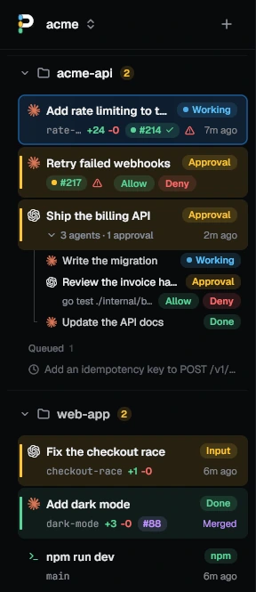
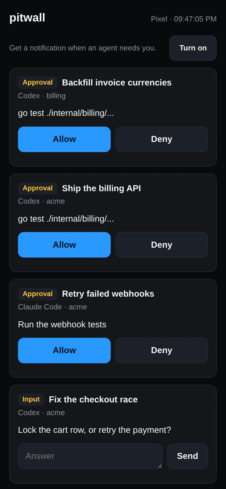
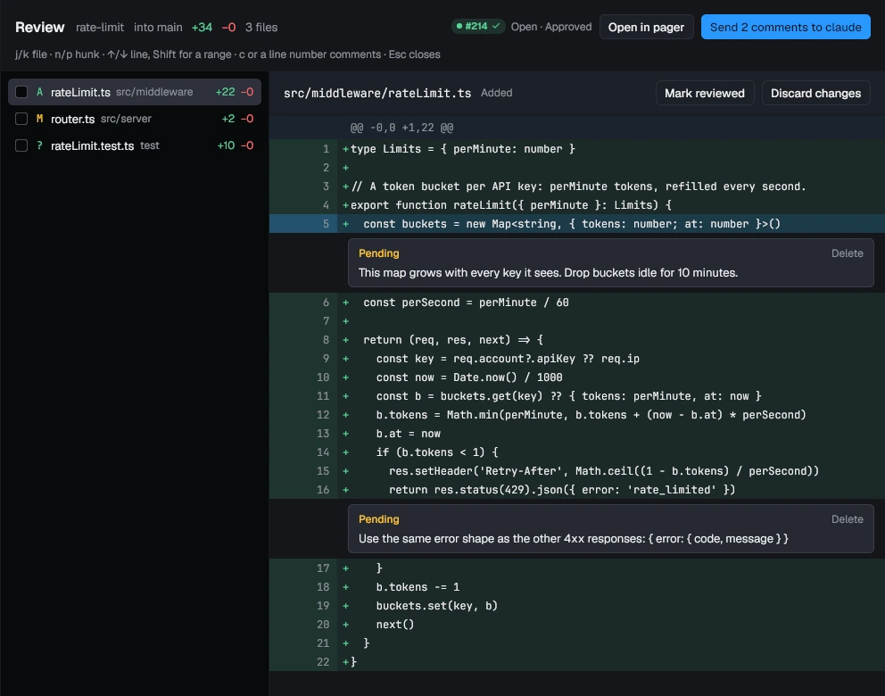
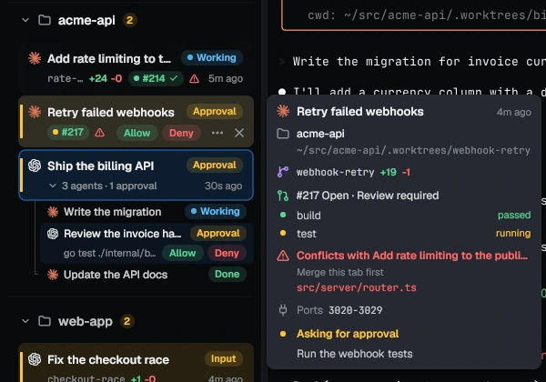
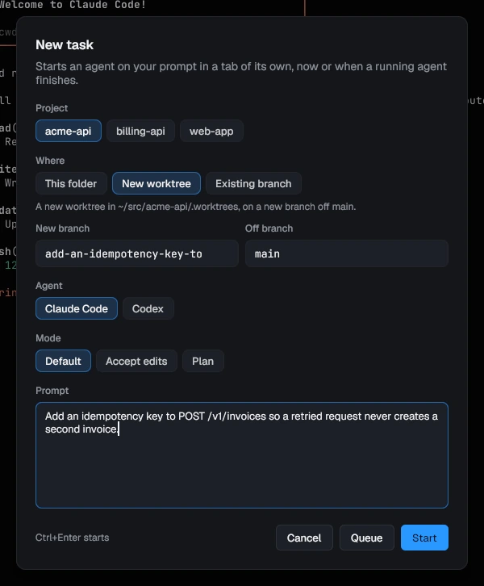
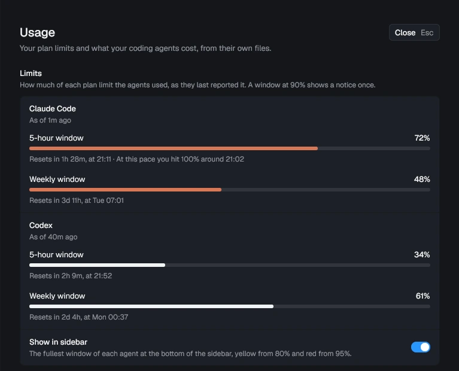
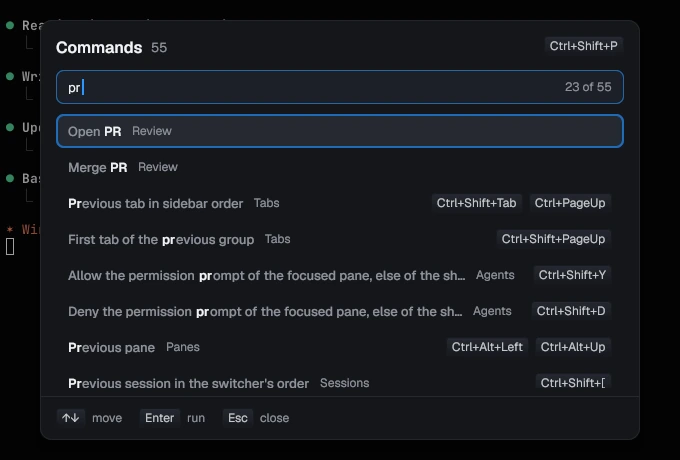

# pitwall


pitwall is a desktop terminal for running several coding agents at once,
with a sidebar that shows what each one is doing right now.

Run five agents in five tabs and one of them is always stuck on a question
you have not seen. pitwall lights up that tab, notifies you, and takes you
there with one key.


pitwall is in beta. It runs every day on Linux; the macOS and Windows
builds are newer. Your tabs and config carry over between releases.

## Install

```sh
brew install quanticstudios/tap/pitwall   # macOS or Linux, with Homebrew
curl -fsSL https://raw.githubusercontent.com/quanticstudios/pitwall/main/scripts/get.sh | sh   # or the script
```

```powershell
scoop bucket add quanticstudios https://github.com/quanticstudios/scoop-bucket
scoop install pitwall                     # Windows, with Scoop
irm https://raw.githubusercontent.com/quanticstudios/pitwall/main/scripts/get.ps1 | iex   # or the script
```

Then run `pitwall`. The first window lists the agents on your `PATH` and
sets up their status reporting with one button. [docs/install.md](docs/install.md)
covers platforms, pinning a version, updates and building from source.

## What you get

### See every agent at a glance



**Every tab's row says what its agent is doing: Working, Input, Approval,
Plan, Done or Error.** A tab with three agents in split panes lists each on
its own line. The row also shows the branch, the lines changed, and the pull
request with its CI and review. Merge it from the tab's menu; once merged,
Archive closes the tab and removes its worktree and branch.

### Get to the one that needs you

**Ctrl+Shift+U jumps to the agent that started waiting most recently, in any
session.** Its pane gets a ring in the state's color and you get a desktop
notification. Press the key again for the next one. Any command can ask
too: `npm test && pitwall notify "tests passed"`.

<br clear="right">

### Answer without switching windows



**Allow or Deny a permission prompt from the sidebar or your phone.**
Ctrl+Shift+Y and Ctrl+Shift+D press the row's buttons, and on Linux the
notification has them too. Pair your phone by QR code and it lists what
needs you, takes typed answers and gets push notifications while locked.
There is no account and no relay: the phone talks to your computer over
your own network.

<br clear="right">

### Review what the agent changed

**Ctrl+Shift+R opens the tab's changes. Comment on any line, then send all
the comments to the agent as one prompt.** Untracked files are included.
Tick off the files you have read; one the agent touches again comes back
unticked. Throw away a file's changes with one button.



### Run agents side by side without collisions

**Give each agent its own git worktree, and pitwall warns you when two of
them edit the same file.** Start one from any branch or a pull request
number. Each gets its own ports (3010-3019, then 3020-3029), so two dev
servers stop fighting over 3000, and can copy `.env` and run your setup
command. Rows turn amber when two branches touch the same files and red
when merging would conflict; the hover card says which to merge first.



### Line up the next task

**New task (Ctrl+Shift+A) starts an agent on a prompt in a tab of its own,
or queues it until a running agent finishes.** Pick the project, a fresh
worktree or a branch, the agent and its permission mode. Cap how many
agents run at once, and the queue starts the next task as one finishes.



### Know what it costs

**See how much of your Claude Code and Codex plan limits you have used, and
when you will hit 100% at this pace.** Settings, Usage also adds up what
the last 7, 30 or 90 days would cost at API prices, per agent and per day.
The agent panel shows each session's tokens and how full its context is.



### Never lose a session

**Close the window, reboot or upgrade, and your tabs come back in their
folders with the agents resumed where they left off.** Sessions work like
tmux, and the switcher (Ctrl+Shift+S) shows every session's agents before
you switch. `pitwall --host box` runs them on another machine over ssh, so
they keep going when the laptop closes.


### Drive it from the keyboard

**Ctrl+Shift+P lists every action with its keys.** Ctrl+Shift+F searches
the scrollback, copy mode (Ctrl+Shift+X) selects with vi keys, and a
selection stays on its text while new output scrolls past. Pick one of four
themes and your own fonts, and rebind any key in Settings or `config.toml`.



## Works with

| Agent       | What pitwall shows                                                   |
| ----------- | -------------------------------------------------------------------- |
| Claude Code | Every state, Allow and Deny, resume, side panel, cost, plan limits   |
| Codex       | Its state, Allow and Deny, resume, side panel, cost, plan limits     |
| Gemini CLI  | Every state but Error, resume, side panel, cost                      |
| OpenCode    | Working, Input, Approval, Done and Error, resume                     |
| pi          | Working, Done and Error, resume, side panel, cost                    |
| Cursor CLI  | Working, Done and Error, resume                                      |
| Aider, Amp  | Aider's state read from its screen; Amp's logo, and its bell rings   |

Builds for Linux, macOS and Windows 10 and 11, on x86_64 and arm64.

## Keys

| Linux, Windows              | macOS                     | Does                                       |
| --------------------------- | ------------------------- | ------------------------------------------ |
| Ctrl+Shift+U                | Cmd+U                     | Go to the agent that needs you             |
| Ctrl+Shift+Y / Ctrl+Shift+D | Cmd+Shift+Y / Cmd+Shift+N | Allow / Deny the permission prompt         |
| Ctrl+Shift+R                | Cmd+Shift+R               | Review the tab's changes                   |
| Ctrl+Shift+A                | Cmd+Shift+A               | New task, now or queued                    |
| Ctrl+Shift+P                | Cmd+Shift+P               | Command palette: every action and its keys |
| Ctrl+Shift+T                | Cmd+T                     | New tab below this one, in its folder      |
| Ctrl+Shift+O / Ctrl+Shift+E | Cmd+D / Cmd+Shift+D       | Split the pane to the right / below        |
| Ctrl+Shift+S                | Cmd+S                     | Session switcher                           |
| Ctrl+Shift+L                | Cmd+L                     | Agent panel: the turn, subagents, plan     |

The aide preset puts these on Alt instead. [docs/keys.md](docs/keys.md) has
every binding, and all of them can be changed.

## Docs

- [Using pitwall](docs/usage.md): first run, watching agents, sessions, review, worktrees, tasks
- [Keybindings](docs/keys.md): the presets, tab mode, pane mode, find, copy mode
- [Command line](docs/cli.md): every command, and driving tabs from scripts
- [Configuration](docs/config.md): config.toml, themes, fonts
- [Hooks](docs/hooks.md): what `pitwall hooks install` changes for each agent
- [Remote hosts](docs/remote.md): agents on another machine over ssh
- [Phone](docs/phone.md): pairing, push notifications, what the page sends
- [Decisions (Jev)](docs/decisions.md): approval advice, triage, turn checks, Decision stats
- [Where things live](docs/state.md): files, saved tabs, reboots, upgrades
- [Install](docs/install.md): platforms, updates, building from source
- [Troubleshooting](docs/troubleshooting.md): what to check, and the logs
- [Agent skill](docs/agent-skill.md): a page to hand an agent that drives pitwall
- [Development](docs/development.md) and [credits](docs/credits.md)

## Contributing

Read [CONTRIBUTING.md](CONTRIBUTING.md) before you send a pull request. Report
bugs with the [issue templates](https://github.com/quanticstudios/pitwall/issues/new/choose),
and vulnerabilities privately as [SECURITY.md](SECURITY.md) describes.

## License

MIT, see [LICENSE](LICENSE).
