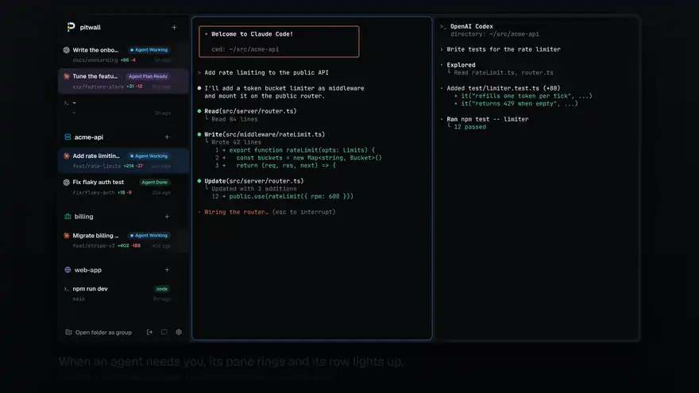
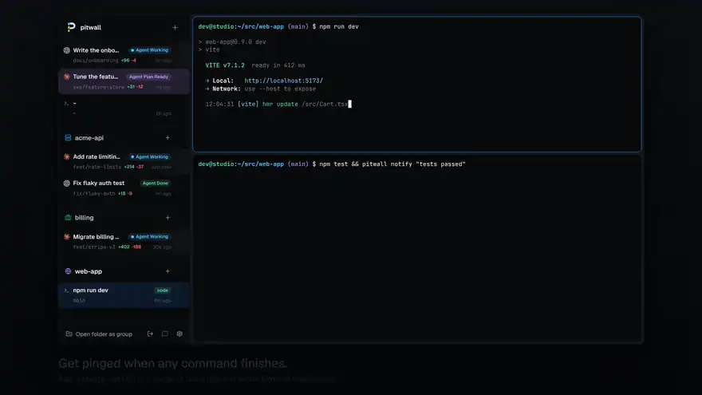
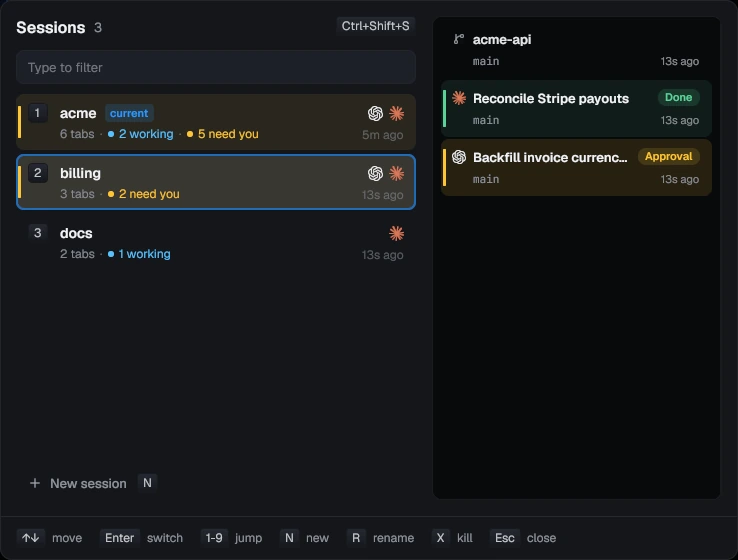
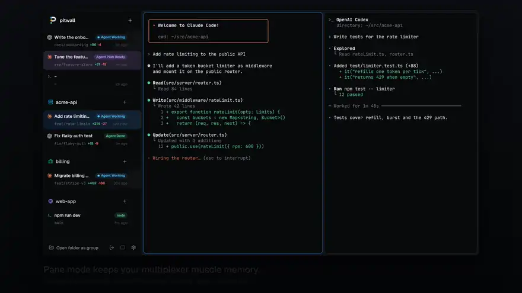
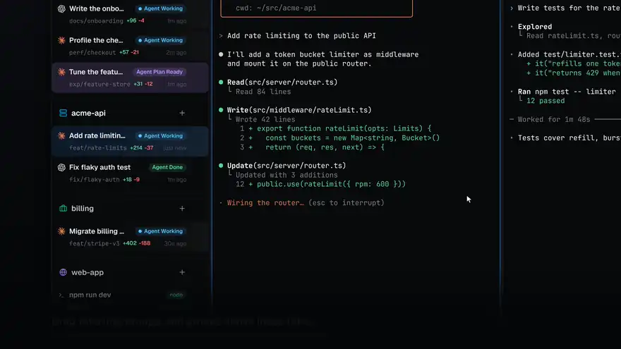
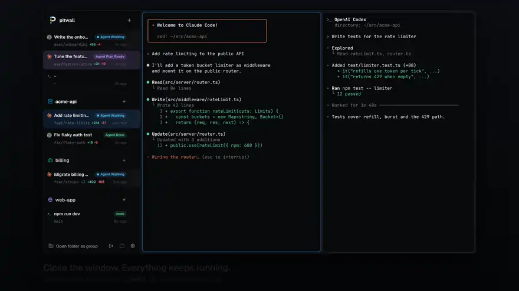

# Using pitwall

pitwall is a terminal multiplexer for running coding agents side by side. It
opens straight into a shell like tmux, but it is a native window: a sidebar
lists every tab and what it is doing right now, whether that is a command
running in a terminal or a coding agent working, waiting for your answer,
asking for approval, done, or failed. Terminals are drawn with real fonts
and pixels, not character cells.

A background daemon owns every terminal. Closing the window leaves tabs
running, and after a reboot they come back in the same folders with agents
resumed where they left off.

## Concepts

- **Session**: a named set of tabs and groups, like a tmux or zellij
  session. Every session keeps running in the daemon; a window shows one of
  them. Names are generated (`swift-otter`) until you rename one.
- **Tab**: one working context, a set of split panes started in a folder. Its
  title follows the work: the agent's topic or first prompt, the running
  command, or the folder the shell is in now (`~` for home). Naming a tab
  replaces the title. The command line also takes its number in `pitwall ls`.
- **Pane**: one terminal.
- **Group**: tabs you put together after the fact, for example all the tabs
  working on one repo. Tabs start ungrouped.
- **Daemon**: the background process that owns the terminals. The window and
  the `pitwall` commands talk to it.

## Everyday use

### Watching agents

Each sidebar row shows a tab's state:

| State    | Meaning                                           |
| -------- | ------------------------------------------------- |
| Working  | The agent is in a turn                            |
| Input    | The agent asked you a question                    |
| Approval | The agent wants permission to run a tool          |
| Plan     | The agent finished a plan and waits for approval  |
| Done     | The agent finished its turn                       |
| Error    | The turn failed                                   |
| `go`     | A terminal is running that command                |

A tab running an agent pitwall knows always shows it, idle or busy: the
agent's logo replaces the row icon. The logo goes when the agent exits back
to the shell.

When an agent needs you (a question, an approval, a plan, an error, a
finished turn) in a pane you are not looking at, that pane gets a ring in the
state's color and its sidebar row gets an accent bar and a dot. Not looking
means another tab, another pane of the same tab, or the window in the
background. The mark stays until you focus that pane, and a group header
counts its tabs that carry one. pitwall also sends a desktop notification
for it. Ctrl+Shift+U (Alt+U in the aide preset) jumps to the pane that most
recently started waiting; press it again for the next one. Once you have
seen them all, it walks the waiting panes by priority.

A tab whose Claude Code or Codex asks permission shows Allow and Deny on
its sidebar row, and Ctrl+Shift+Y and Ctrl+Shift+D press them for the
focused pane, else for the shown tab. They press the same keys the
[phone page](phone.md) does, and only while the pane still shows the prompt
the row showed, so a click never lands on a newer question. With a decision
model, its advice stays in the pill above them, and the button it
recommends is outlined.

On Linux, a click on a notification raises the window on its pane, as
Ctrl+Shift+U does, and an approval's notification has Allow and Deny too.
This needs notify-send from libnotify 0.7.10 or later; older ones show plain
notifications. macOS notifications from osascript take no actions, so a
click there does nothing, and Windows toasts stay plain.

Settings > Notifications, or `[notifications]` in config.toml, picks what
notifies:

```toml
[notifications]
sound = "bell"                # or a sound file's path; "" (the default) for none
approval = true               # permission prompts and plans
input = true                  # questions, pitwall notify, bells
done = false                  # finished turns
failed = true                 # failed turns
muted_agents = ["codex"]      # claude, codex, pi, gemini, opencode, terminal
quiet_hours = "22:00-08:00"   # no sound, and only approvals, errors and triage's "now"
```

The sound plays with paplay, pw-play or afplay, whichever is installed.
Triage's fyi still sends nothing.



Any command can ask for your attention, no hooks needed:
`npm test && pitwall notify "tests passed"` rings the pane it runs in. Tools
that send terminal notifications ring it too: OSC 9 (iTerm2's form), OSC 777
(urxvt, foot, Ghostty) and kitty's OSC 99 in its single-chunk form. The pane
then shows as Input with the message until you focus it or the agent's state
changes. ConEmu's numeric OSC 9 forms, such as `9;4` progress, are ignored.

A bell (BEL, `printf '\a'`) rings the pane the same way, with "Bell" as the
message, when you are not looking at it. In the pane you are looking at a
bell does nothing, so a failed tab completion stays quiet. A pane rings at
most once a second however many bells arrive, and a pane whose agent already
needs you keeps that agent's state. Set `bell = "off"` under `[terminal]`
to ignore bells.



States are exact when the agent's hooks are installed (`pitwall hooks
install`). Without hooks, pitwall still recognizes an agent running in a
pane and, for most, reads its state from the screen, which is a little less
precise. It knows an agent by its process name, and one an interpreter runs
(`node`, `bun`, `deno` or `python`, as an npm or pip install does) by
the path of its script. For that it reads the start of the argument list of
the processes in the pane's own foreground group, and nothing else's.

| Agent      | Hooks        | States without hooks    | Resumes after a restart | Side panel and usage |
| ---------- | ------------ | ----------------------- | ----------------------- | -------------------- |
| Claude     | yes          | from the screen         | yes                     | yes                  |
| Codex      | yes          | from the screen         | yes                     | yes                  |
| pi         | an extension | from the screen         | yes                     | yes                  |
| Gemini CLI | yes          | from the screen         | yes                     | yes                  |
| OpenCode   | a plugin     | from the screen         | yes                     | no                   |
| Cursor CLI | yes          | none (the logo only)    | yes                     | no                   |
| Amp        | none         | none (the logo only)    | no                      | no                   |
| Aider      | none         | Working, Input and Done | no                      | no                   |

Some states are out of reach:

- pi has no permission prompts of its own, so a pi tab shows Working, Done,
  Error or nothing, never Input, Approval or Plan; a dialog an extension
  opens with `ctx.ui.confirm` is not reported.
- Gemini CLI fires no hook when a turn fails, so with hooks it never shows
  Error; a failed turn stays Working until the next prompt.
- OpenCode shows Plan only with its experimental plan mode on
  (`OPENCODE_EXPERIMENTAL_PLAN_MODE=1`), when it asks to switch to the
  build agent.
- Cursor's prompt and approval hooks decide for the agent, so pitwall does
  not install them: a Cursor tab shows Working, Done, Error or nothing,
  never Approval.
- Amp and Aider have no hooks. Amp gets no state from pitwall's own rules,
  as its screen's text is not documented; turn on its notifications
  (`amp.notifications.enabled`, with `AMP_FORCE_BEL=1`) and its bell rings
  the pane. Aider shows Working while it waits for the model, Input at a
  yes/no question, and Done at its prompt.
- With [`[decisions.agents]`](decisions.md#features) on, a decision model
  reads the screens of the agents it lists instead of these rules.

OpenCode keeps its sessions in SQLite, which pitwall does not read, so its
side panel shows only its state.

When an agent runs in a pane without reporting, the pane shows "Install
hooks for live status" with an Install button: after the agent has run for
20 seconds without a hook, or as soon as its screen shows a turn (Codex and
Cursor send nothing until their first prompt). Install lists what would
change in each config, then installs on confirm. Settings > Agents has the
same button. Agents already running load their hooks only when restarted.

### Sessions



A session is a separate set of tabs and groups with a name, the way tmux
and zellij work: one per project or per piece of work, each with its own
sidebar. All of them keep running in the daemon. The sidebar header shows
the session's name, the window title is `<session> · pitwall`, and the panes
fade in when the window switches, so you know where you are.

Ctrl+Shift+S (Alt+S in the aide preset), or a click on the session name in
the sidebar header, opens the session switcher. It lists every session with
its agents, how many are working and how many need you, and when it was last
active; a session with something you have not seen gets an accent bar. The
right side draws the highlighted session's sidebar as it is now, so you can
watch its agents before you switch. In the switcher:

| Key           | Does                                                                     |
| ------------- | ------------------------------------------------------------------------ |
| j / k, arrows | Move                                                                     |
| Enter, click  | Switch the window to the session                                         |
| 1-9           | Switch to the Nth session                                                |
| any other key | Filter by name (`/` starts a filter that may begin with j, k, n, r or x) |
| n             | New session; type a name or keep the suggested one                       |
| r             | Rename the highlighted session                                           |
| x             | Kill the highlighted session, after a y                                  |
| Esc           | Clear the filter, then close                                             |

Ctrl+Shift+] and Ctrl+Shift+[ (Alt+] and Alt+[ in aide) step through the
sessions without the switcher, and Ctrl+Shift+N makes one. Ctrl+Shift+U
crosses sessions: it switches to the session of the pane that needs you.
Desktop notifications start with the session's name.

Each window shows one session, and you can open as many windows as you like.
Running `pitwall` again opens another window: on the most recent session no
window shows, else on a new session in the folder you ran it from.
`pitwall -s <name>` opens one on that session, making it if it does not
exist. Asking for a session another window already shows raises that window.
When a session ends, because you killed it or closed its last tab, its
windows move to the most recently used session, or close when none is left.

### Tabs and panes



The keyboard shortcuts are in [Keybindings](keys.md). With the mouse:
click a tab to switch to it, double-click it to rename it, middle-click to
close it, right-click it for **New tab below**, **Rename tab**, **Detach
tab**, **Close tab**, grouping, and more. The "+" in the sidebar header or on
a group header opens a new tab right below the one you were in, in the same
group and folder.

Rest the pointer on a tab for half a second and a card opens beside the
sidebar with what the row cuts off: the full title, the group and folder, the
branch with its diff stats, the agent's state and question, and the pane
count. Move to another tab and the card follows at once.

Drag a tab or a group header to reorder it: the other rows slide apart to
show where it will land, and Escape puts it back. Groups and ungrouped tabs
share one order, so a group can sit above loose tabs and a loose tab between
two groups: drop on the top half of a group header to land above the group,
on the bottom half to land first inside it. Rest on a group header for
a moment, or drop on a collapsed one, to move the tab to the end of that
group. Ctrl+click or Shift+click several tabs to drag them together. Drag the
gaps between panes to resize them.
Ctrl+Shift+B (Ctrl+B in the aide preset) hides the sidebar; pitwall
remembers that across restarts.

Ctrl+Shift+L opens the agent panel on the right. It follows the focused pane and
reads the agent's own session file: Flow shows the current turn from prompt
to outcome, with a pending approval and the decision model's suggestion;
Subagents lists what each spawned agent was asked and is doing; Plan is the
agent's todo list; Changes lists the files changed from the default branch;
Timeline lists prompts, tool calls and subagents with their times. The panel
is 432dp wide (scaled with the display), narrows to 320dp in a small window,
then hides. Each window keeps its own open state until it closes. Ctrl+L still
reaches the shell, to clear the screen.

To review an agent's work, press Ctrl+Shift+R (Cmd+Shift+R in mac), pick
View diff from the tab's "…" menu or the command palette, or click a file
under Changes. The review
view takes the place of the tab's panes, as the settings page does, and Esc
closes it. It shows the changes from the merge base with the default branch
to what is on disk now: committed, staged, unstaged and untracked. The files
are on the left with their status (M, A, D, R for a rename, ? for untracked)
and line counts; the selected file's diff is on the right, with both line
numbers and the unchanged lines between hunks folded into a row you click to
unfold. j and k move between files, n and p between hunks, the arrows
between lines, Shift+arrows select a range. A binary file, an untracked file
over 1 MiB and a file with over 3,000 changed lines show a line about
themselves instead; the last has a button to show its diff anyway.

Click a line number, or press c on the selected lines, to comment;
Shift+click a second line number to comment on the lines between. Enter
saves the comment under its last line. "Send N comments to claude" types
every pending comment into the tab's agent as one prompt: a line saying what
it is, then each comment's file:line, the lines it is on quoted with their
diff marks, and its text. It goes in as a bracketed paste followed by Enter,
the way the phone's replies do. An agent that is working, asking permission
or showing a plan gets it when it next waits for input; the comments read
Queued until then, and Sent after. A sent comment goes away once the agent
changes its lines.

Mark reviewed checks a file off in the list. pitwall remembers the mark per
worktree and per change, in `gui.json` in the state directory, so a file the
agent changes again comes back unchecked. Discard changes, after a dialog,
puts the file back as it is at the merge base with `git restore`, on disk
and staged, or deletes an untracked file. The header shows the branch, its
base and the totals, Create pull request, and Open in pager, which runs the
same diff through `git diff` in your pager in a new pane: `$GIT_PAGER`, else
`core.pager`, else delta when it is installed, else `less -R`. Press q to
close it. The palette's Open diff in pager does the same. With `pitwall
--host`, the worktree is on the host, so View diff opens the pager there.
Create pull request opens a tab in the tab's folder that runs
`git push -u origin HEAD` when the branch has no upstream, then
`gh pr create --fill`, so you see both commands and answer gh's questions
there; the tab stays when gh exits, with the pull request's link. It never
force-pushes. The menu greys the entry out and says why when gh is not
installed, the tab is on the default branch, or the branch has no commits
ahead of it. Create pull request and Open diff in pager have no key by
default; set `create_pr` or `diff_pager` under `[keys]` to give them one.

Once the branch has a pull request, its row shows a chip with the number,
green while open, grey as a draft, purple once merged and red when closed.
On an open one, a dot before the number is CI: yellow while checks run,
green when they pass, red when one failed, and a check or a red diff glyph
after it is the review: approved, or changes requested. The hover card lists
the checks by name. Click the chip to open the pull request in your browser.
The daemon asks `gh pr view` about each branch: at once for a new branch,
every minute for an open pull request and every five for a branch without
one, five times slower while no pitwall window has focus, and not at all
for 15 minutes after GitHub says its rate limit is hit. It never asks you to
log in: without `gh`, or logged out, the row shows nothing.

The "…" menu and the command palette then have Open PR, Merge PR and, when
a check failed, Re-run failed checks in place of Create pull request.
Merge PR asks first and, with failed checks, asks again; it runs
`gh pr merge --squash` in a new tab, or `--merge` or `--rebase` per
`merge_method` under `[git]`. Re-run failed checks runs
`gh run rerun --failed` on the branch's latest failed run, in a tab too.
When the pull request has merged, the row says Merged and its hover buttons
add Archive, which closes the tab and, for a worktree pitwall made, removes
the worktree and deletes the branch, as Delete does with its box ticked.
Set `archive_on_merge = true` under `[git]` to archive a merged worktree
tab without the click.
Agents in worktrees of one repository can edit the same files without
knowing it. When two tabs on different branches of the same repository
change a file in common, committed or not, both rows get a warning
triangle after their diff stats: amber when they only touch the same files,
red when merging their commits would conflict (`git merge-tree`, which
leaves the work trees alone). Uncommitted changes count as touching, never as
a conflict. The hover card names the other tab, lists the files with the
conflicting ones first in red, and suggests which branch to merge first: the
one with fewer conflicting files, else the one not behind the default
branch, else the smaller one. Click a file in the card to open its diff in
that tab. The first time two tabs share a file, a notice says so, such as
"billing and acme-api both edit src/server/router.ts"; it comes back only for
a new file or a new conflict. pitwall checks when it refreshes the branch
stats, at most every 30 seconds, and only while tabs sit on two or more
branches. Set `conflict_radar = false` under `[git]` to turn it off.

Under the tabs, a line shows the agent's model, the tokens its session used
and how full its context window is, with a small meter that turns yellow at
80% and red at 95%. Flow's Session section splits the tokens into input,
output, cache read and cache write, by model when the session used several,
subagents included. A tab's hover card shows the same line for its agents.
The counts come from the agent's session file: Claude Code's message usage,
Codex's token counts, pi's message usage. A file over 8 MiB is read from its
last 8 MiB, so its counts read "≥". Cost in dollars is off, since a
subscription does not bill per token; set `show_cost = true` under `[usage]`
or use the switch under Agents in the settings page to add what the tokens
would cost at the API's list prices. pitwall carries a dated price table and
shows its date; a model missing from it shows tokens and no cost.

Settings, Usage adds up every Claude Code, Codex and pi session on the
machine over the last 7, 30 or 90 days: the total cost and each agent's
share, a daily cost chart, cached and uncached input, output, what cache
reads saved against the full input price, and a table by model or by day.
It reads `~/.claude/projects`, `~/.codex/sessions` and pi's `sessions`
directory, opens only files written in the window, and on a reopen reads
only what the agents appended since. A call that Claude Code repeats in a
subagent's or a resumed session's file counts once. Models without a list
price show as Unpriced and add tokens but no cost.

Above the costs, Limits shows how much of each plan limit Claude Code and
Codex last reported using: a bar per window (5-hour and weekly), when it
resets, how long ago the agent reported it, and, at the pace of the window
so far, when it would reach 100% if that is before the reset. A window
whose reset time has passed shows 0% until the agent reports again. Codex
logs its limits in its session files; pitwall reads the last 8 days of them
every minute. Claude Code reports its limits only to its status line, so
the Set up button there opens the hooks dialog with pitwall's status line
ticked (see [Hooks](hooks.md#plan-limits)). pitwall never asks Anthropic or
OpenAI for them. When a window reaches 90%, a notice at the top of the
panes says so once, such as "Claude 5-hour window at 90%, resets 16:40".
Set `limits_in_sidebar = true` under `[usage]`, or use the switch under
Limits, to show each agent's fullest window at the bottom of the sidebar,
yellow from 80% and red from 95%.

Selecting text with the mouse copies it to the clipboard, as zellij and Warp
do, and a small "Copied 42 characters" notice shows at the bottom of the panes.
Drag to select, double-click a word, triple-click a line (the whole line
the program printed, across the rows it wrapped onto), Alt+drag a block, or
hold Shift when a program owns the mouse. Drag past the top or bottom of the
pane to scroll it, faster the further you go, so one selection can take any
amount of history. A selection stays on its text while new output scrolls
it, and goes when that text leaves the history or the pane is resized. Copy
mode selects with the keyboard; see [keys](keys.md). To turn copying on
select off, set `copy_on_select = false` under `[terminal]` in
config.toml or use the switch under Terminal in the settings page; Ctrl+Shift+C
still copies.

Links in panes are underlined, both URLs in the text and OSC 8 hyperlinks.
Ctrl+click one (Cmd+click on macOS) to open it in your browser, even inside
Claude Code or Codex.
Set `links = false` under `[terminal]` to turn this off.

Programs can set the clipboard with OSC 52, the way Neovim, tmux and Helix
copy, also over ssh: `printf '\e]52;c;%s\a' "$(printf hi | base64)"` puts
"hi" on it. A write may hold up to 1 MB of text. Programs can never read
the clipboard this way: pitwall leaves OSC 52 read requests unanswered, so a
program cannot see what you copied elsewhere. Set `osc52 = "off"` under
`[terminal]` to ignore the writes.

Ctrl+Shift+Up and Ctrl+Shift+Down scroll the pane back and forward to the
previous and next shell prompt, putting it at the top of the pane; past the
last prompt the pane is back at the live screen. This needs a shell that
marks its prompts with OSC 133 (shell integration). fish 4.0 and later
mark them on their own. For zsh, add to `~/.zshrc`:

```zsh
_pitwall_precmd() { print -Pn '\e]133;D;%?\a\e]133;A\a' }
_pitwall_preexec() { print -n '\e]133;C\a' }
autoload -Uz add-zsh-hook
add-zsh-hook precmd _pitwall_precmd
add-zsh-hook preexec _pitwall_preexec
PS1+=$'%{\e]133;B\a%}'
```

For bash 4.4 or later, add to `~/.bashrc`, after anything that sets `PS1`:

```bash
PROMPT_COMMAND='printf "\e]133;D;%s\a\e]133;A\a" "$?"'${PROMPT_COMMAND:+;$PROMPT_COMMAND}
PS1+='\[\e]133;B\a\]'
PS0='\e]133;C\a'
```

Only the prompt start (`133;A`) is needed to jump; pitwall keeps the
other marks on their rows too. The keys are `prev_prompt` and
`next_prompt` in config.toml.

### Grouping



- **By folder:** right-click a tab and choose **Group tabs in `<folder>`**.
  Every ungrouped tab in that repo or folder joins one group, and new tabs you
  start inside that folder join it automatically.
- **By hand:** Ctrl+click or Shift+click to pick tabs, then right-click
  and choose **New group** or **Move to group**.
- **Ungroup** or **Remove from group** never close anything.

Tabs inside a group sit indented under its header; loose tabs stay flush.

For a Git repo group, **New worktree tab** in the group menu starts a tab in a
fresh worktree under `<repo>/.worktrees/`, so parallel agents on one repo do
not step on each other. The dialog picks what it checks out:

- **New branch**: a branch named after the tab, off a base you pick from
  the local and remote branches (the default branch unless you change it).
- **Branch**: an existing local branch.
- **Remote branch**: a new local branch of the same name that tracks it.
- **Pull request**: when origin is on GitHub, the pull request's head,
  fetched like `gh pr checkout` into the branch `pr-<number>`.

The first worktree in a repo adds `/.worktrees/` to `.git/info/exclude`, so
the worktrees never show in `git status`. Your `.gitignore` is left alone.

Deleting that tab removes the worktree it made. pitwall never deletes a
folder it did not create, nor the main checkout. When the worktree has
uncommitted or untracked files, the delete dialog lists them and its button
reads **Delete anyway**. Deleting the branch too warns when it has commits
the default branch lacks.

**Clean up worktrees** in the command palette runs `git worktree prune` in
every repo group and lists the worktrees under `.worktrees/` that no tab
uses, with their last commit and whether they have changes, to open in a
tab or delete. Their branches stay. The daemon prunes on start too, and
says when it finds such worktrees. `pitwall worktree` does the same from a
terminal (see [Command line](cli.md)).

### Worktree ports and setup

Each worktree tab pitwall makes gets its own block of 10 ports, so two
agents can each run a dev server without one crashing on a taken port. The
first gets 3010-3019, the next 3020-3029, and the main checkout keeps 3000.
Every pane in the tab has:

| Variable            | Value       |
| ------------------- | ----------- |
| `PORT`              | `3010`      |
| `PITWALL_PORT_BASE` | `3010`      |
| `PITWALL_PORTS`     | `3010-3019` |

Tabs outside a pitwall worktree, the main checkout's included, get none of
them. The block is saved with the tab, so it survives a restart, and no
other tab gets it while this one exists. The tab's hover card shows the
block, and the agent panel's Changes view shows `PORT 3010`. When a shell
or command in the tab prints `EADDRINUSE` or "address already in use", the
tab asks for you with "Port in use: this worktree's ports are 3010-3019".

Next.js, Create React App, Rails with Puma's default config and any app that
reads `process.env.PORT` pick up `PORT` on their own. Others need it passed:

- Vite: `server: { port: Number(process.env.PORT) || 5173, strictPort: true }`
  in `vite.config.ts`, or `vite --port $PORT --strictPort`. Without
  `strictPort`, Vite quietly moves to the next port, which may be another
  tab's.
- Astro: `astro dev --port $PORT`.
- Storybook or a second service in the same tab: count up from the base,
  `storybook dev -p $((PITWALL_PORT_BASE + 1))`, up to the end of
  `PITWALL_PORTS`.

`port_base` and `port_step` under `[worktrees]` in `config.toml` move the
blocks and size them; `port_step = 0` turns ports off.

A repo can also bring files into each new worktree and run a command there,
from `.pitwall/worktree.toml` at its root, or `[worktrees]` in `config.toml`
for every repo. Nothing is copied, linked or run without one.

```toml
# .pitwall/worktree.toml
copy = [".env", ".env.local"] # copied from the main checkout
link = ["node_modules"]       # symlinked to the main checkout's
setup = "pnpm install"        # typed into the new tab's shell
```

- `copy` takes files, not folders, and keeps their permissions. `.env`
  holds secrets, so pitwall copies it only when you list it.
- `link` saves an install, but a shared `node_modules` breaks when branches
  need different dependencies, and an install in one worktree changes it for
  all of them. A `.gitignore` line `node_modules/` matches only a folder, not
  the link: write `node_modules`.
- A path the worktree already has, or the main checkout lacks, is skipped.
  Nothing is overwritten, and paths must stay inside the repo.
- `setup` is typed into the first pane of the new tab after `copy` and
  `link`, so you watch it run and keep the shell afterwards. A `setup` from
  your own `config.toml` runs at once. One from the repo's
  `.pitwall/worktree.toml` is typed without Enter: anyone can put a command
  in a repo you clone, so it waits on the prompt until you read it and
  press Enter. One with a line break or another control character is not
  typed at all.

Keys in the repo's file win over `config.toml`. A mistake in it shows as an
error when you make the tab, and the tab is made anyway.

### Tasks and the queue

**New task** (Ctrl+Shift+A, the command palette, or **New task…** in a
group's menu) starts an agent on a prompt in a tab of its own, as
`pitwall new -- codex "…"` does. Pick:

- **Project**: a folder of this session's groups and tabs, the open tab's by
  default. A worktree tab counts as its main checkout.
- **Where**: the folder itself, a new worktree on a new branch (named from
  the prompt, made off the default branch unless you name another), or a
  new worktree on an existing branch. Worktrees get their ports and
  `.pitwall/worktree.toml` setup as **New worktree tab** does; setup runs
  in a shell under the agent.
- **Agent**: the agent CLIs on your PATH. The dialog remembers the last one.
- **Mode**: for Claude Code, Accept edits or Plan (`--permission-mode`);
  for Codex, Read only or Auto (`-s` and `-a`).
- **Prompt**: passed as the agent's first argument. Ctrl+Enter starts it.

**Queue** puts the task in the session's queue instead, shown under its
group in the sidebar (or at the bottom), with start-now and remove on hover.
A queued task starts when a running agent of its session finishes: done,
failed or closed. With `max_running` under `[agents]` in `config.toml` (or
**Agents at once** in Settings), queued tasks start whenever fewer than that
many agents run in the session. The queue survives a daemon restart.

```sh
pitwall queue add -- codex "fix the flaky login test"   # in the current folder
pitwall queue ls
pitwall queue rm 1
```

### Detaching



**Detach** (right-click a tab, or `pitwall detach`) hides a tab and keeps
everything in it running. The **Detached** list in the sidebar footer brings
it back, as does `pitwall attach <name>`.

### Let agents name their tab

Claude Code and Codex set a terminal title, which pitwall shows as the tab's
title with spinners stripped. pi's title is `π - <folder>`, which says
nothing about the work, so a pi tab shows its first prompt instead, or the
session name once you set one with `/name`. An agent can also name its tab explicitly:

```sh
pitwall tab rename "fix login redirects"
```

To have agents do this on their own, add to your `CLAUDE.md` or `AGENTS.md`:

```markdown
At the start of a task inside a pitwall pane, run
`pitwall tab rename "<short description of the task>"`.
```
