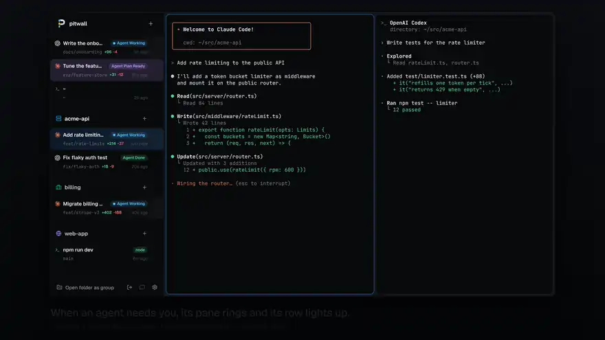
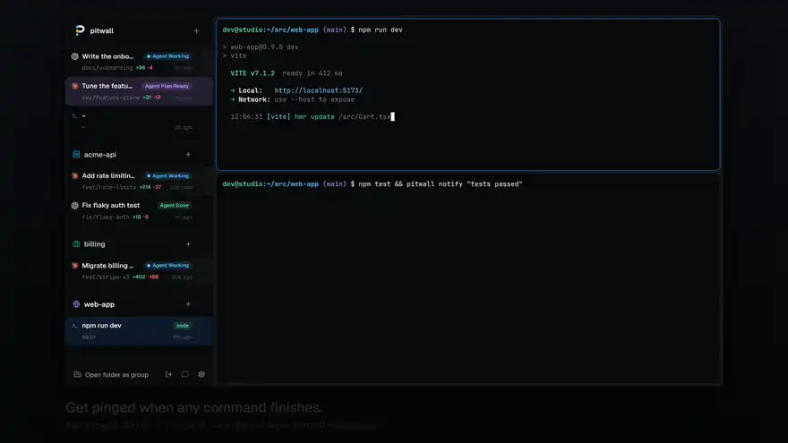
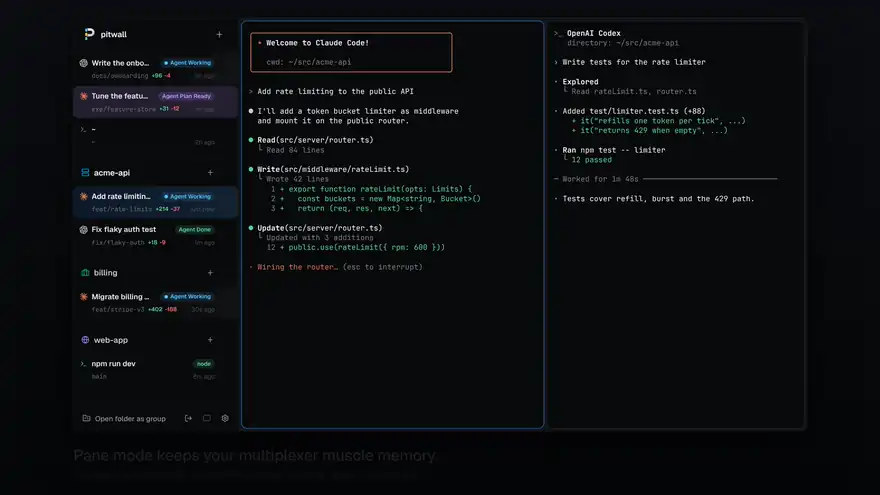
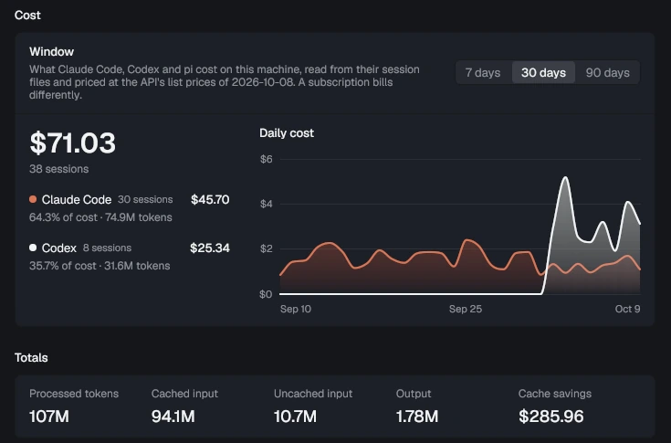
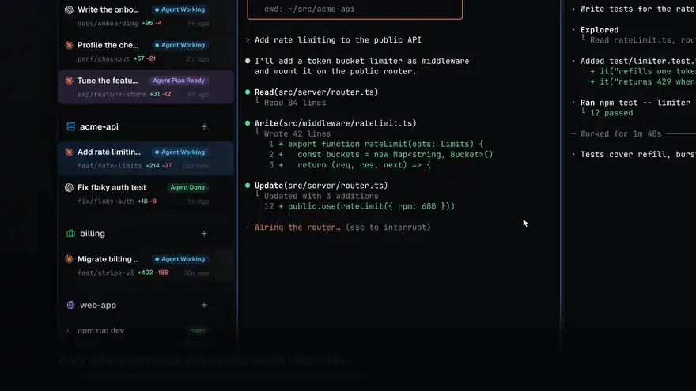
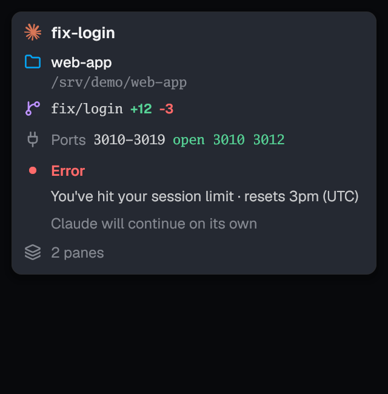
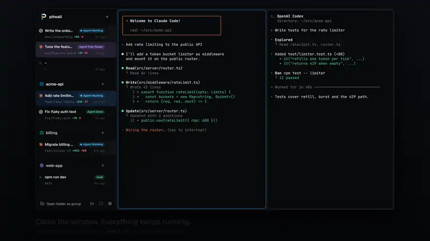

# Using pitwall

pitwall is a terminal multiplexer for running coding agents side by side. It
opens straight into a shell like tmux, but it is a native window: a sidebar
lists every tab and what it is doing right now, whether that is a command
running in a terminal or a coding agent working, waiting for your answer,
asking for approval, done, or failed. Terminals are drawn with real fonts
and pixels, not character cells.

A background daemon owns every terminal. Closing the window leaves tabs
running, and after a reboot they come back in the same folders with agents
resumed where they left off.

## Concepts

- **Session**: a named set of tabs and groups, like a tmux or zellij
  session. Every session keeps running in the daemon; a window shows one of
  them. Names are generated (`swift-otter`) until you rename one.
- **Tab**: one working context, a set of split panes started in a folder. Its
  title follows the work: the agent's topic or first prompt, the running
  command, or the folder the shell is in now (`~` for home). Naming a tab
  replaces the title. The command line also takes its number in `pitwall ls`.
- **Pane**: one terminal.
- **Group**: tabs you put together after the fact, for example all the tabs
  working on one repo. Tabs start ungrouped.
- **Daemon**: the background process that owns the terminals. The window and
  the `pitwall` commands talk to it.

## First run

```sh
pitwall
```

The first window shows a welcome card. It lists the agent CLIs it found on
your `PATH` (Claude Code, Codex, Gemini CLI, OpenCode, pi, Oh My Pi, Cursor CLI, Amp,
Aider) and whether each one's hooks are installed. Start opens an agent in
a tab of its own, and Install hooks shows what it would change before it
changes it. Dismiss the card, or do anything else, and it never shows
again. With no agent on your `PATH`, you get a shell and a line with where
to install one.

Hooks let agents report their state exactly. To install them from a
terminal instead:

```sh
pitwall hooks install --dry-run   # see what would change
pitwall hooks install             # let your agents report their state
pitwall doctor                    # check every line says ok
```

`pitwall update` installs the latest release and hands the running
daemon's panes to it, their programs still running; see
[Updates](install.md#updates) for what it does when that fails.

The window opens on a shell in the folder you launched it from, in a
session with a generated name such as `swift-otter`. Run `claude`, `codex`,
`pi`, a dev server, anything. The tab's row in the sidebar shows what is
happening: the name of a running command, or the agent's state.

Open more tabs with **+** in the sidebar header. Each tab can be split into
panes. Typing `exit` closes a pane; an empty tab closes, and the session
ends with its last tab. Closing the window only detaches it: every session
keeps running, and `pitwall` opens the most recently used one again.

## Everyday use

### Watching agents

Each sidebar row shows a tab's state:

| State    | Meaning                                                                    |
| -------- | -------------------------------------------------------------------------- |
| Working  | The agent is in a turn                                                     |
| Input    | The agent asked you a question                                             |
| Approval | The agent wants permission to run a tool                                   |
| Plan     | The agent finished a plan and waits for approval                           |
| PR open  | The agent finished its turn, and the tab's branch has an open pull request |
| Done     | The agent finished its turn                                                |
| Error    | The turn failed                                                            |
| `go`     | A terminal is running that command                                         |

A tab running an agent pitwall knows always shows it, idle or busy: the
agent's logo replaces the row icon. The logo goes when the agent exits back
to the shell.

In a repo, the tab shows the repo's icon with the agent's logo as a badge
on its corner, or the icon alone for a shell, and the repo's group shows it
in place of the folder. So does a group you made by grouping tabs, when
all its tabs are in one repo; a worktree counts as its repo. The icon follows the folder the tab's first pane is
in now, so a shell that changes into a repo shows that repo's icon.
pitwall looks for `.pitwall/icon.svg`, `.png` or `.ico` first, so you can
pick one by putting it there. Then it looks for `favicon.svg`,
`favicon.ico` or `favicon.png` at the top, then in `public/`, `static/`,
`app/`, `src/app/`, `assets/` and `apps/*/public/`, then `logo` and
`icon` files. It reads SVG, PNG and ICO files, and looks once per repo
while the window is open. A repo with none gets a tile with its name's
first letter, in its group's color or one picked from the name. An icon
you pick for a group in **Icon and color** wins over the repo's. The
picker's first tile is the repo's icon itself, for a group that has a
repo: pick it to go back to the repo's icon.

After its name, a group header counts its tabs by state, with the glyph
their rows show: tabs that need you (an approval, a question or a plan),
then tabs working, then tabs with a finished turn you have not seen. A
state with no tabs is left out, so an idle group shows nothing after its
name.

A tab with two or more agent panes keeps one row with its most urgent state
and a count such as "3 agents · 1 approval". Under it, each agent pane gets
a small row of its own with the agent's logo, the pane's title and its
state. Click one to show the tab with that pane focused. Click the count to
fold these rows away or bring them back. Plain shells and panes running a
command get none.

When an agent needs you (a question, an approval, a plan, an error, a
finished turn) in a pane you are not looking at, that pane gets a ring in the
state's color and its sidebar row gets an accent bar. Not looking
means another tab, another pane of the same tab, or the window in the
background. The mark stays until you focus that pane. pitwall also sends a desktop notification
for it. Ctrl+Shift+U (Alt+U in the aide preset) jumps to the pane that most
recently started waiting; press it again for the next one. Once you have
seen them all, it walks the waiting panes by priority.

A tab whose Claude Code or Codex asks permission shows Allow and Deny on
its sidebar row, or on the asking pane's own row when the tab lists its
agents, and Ctrl+Shift+Y and Ctrl+Shift+D press them for the
focused pane, else for the shown tab. They press the same keys the
[phone page](phone.md) does, and only while the pane still shows the prompt
the row showed, so a click never lands on a newer question. With a decision
model, its advice stays in the pill above them, and the button it
recommends is outlined.

A Plan row has **Request changes…**. It opens a field on the row: type
what should change and press Enter, or Esc to cancel. pitwall never
answers the plan dialog. It queues your text and types it, as your reply,
the next time the agent waits for input, so choose No in the dialog
yourself. A notice says when the text waits.

A working agent whose screen has not changed for 20 minutes shows
**quiet 20m** on its row in place of the time, and in its hover card. An
agent can hang mid-turn, and Gemini CLI never reports a failed turn, so
Working alone does not mean busy. Set the minutes with `quiet_after` under
`[agents]` in `config.toml`, or **Quiet after** in Settings; 0 turns it
off. With `continue_when_quiet = true` (**Continue when quiet**), pitwall
also types `continue` and Enter into a quiet agent, once. It does so only
for Claude Code, Codex, pi, Gemini CLI and OpenCode, whose prompts it reads
from the screen, and only while the screen shows no prompt, form or
spinner. It types again only after the agent stops working or you type in
its pane.

A script can put a line of text under a tab's row, such as the state of CI:

```sh
pitwall status 3 -- "CI 3/7"     # tab #3; a pane address works too
pitwall status -- "on review"    # inside a pane: its own tab
pitwall status 3                 # clear it, as --clear does
```

The hover card shows it too, and it goes when the tab closes.

On Linux, a click on a notification raises the window on its pane, as
Ctrl+Shift+U does, and an approval's notification has Allow and Deny too.
This needs notify-send from libnotify 0.7.10 or later; older ones show plain
notifications. macOS notifications from osascript take no actions, so a
click there does nothing, and Windows toasts stay plain.

Settings > Notifications, or `[notifications]` in config.toml, picks what
notifies:

```toml
[notifications]
sound = "bell"                # or a sound file's path; "" (the default) for none
approval = true               # permission prompts and plans
input = true                  # questions, pitwall notify, bells
done = false                  # finished turns
failed = true                 # failed turns
muted_agents = ["codex"]      # claude, codex, pi, omp, gemini, opencode, terminal
quiet_hours = "22:00-08:00"   # no sound, and only approvals, errors and triage's "now"
```

The sound plays with paplay, pw-play or afplay, whichever is installed.
Triage's fyi still sends nothing.



Any command can ask for your attention, no hooks needed:
`npm test && pitwall notify "tests passed"` rings the pane it runs in. Tools
that send terminal notifications ring it too: OSC 9 (iTerm2's form), OSC 777
(urxvt, foot, Ghostty) and kitty's OSC 99 in its single-chunk form. The pane
then shows as Input with the message until you focus it or the agent's state
changes. ConEmu's numeric OSC 9 forms, such as `9;4` progress, are ignored.

A bell (BEL, `printf '\a'`) rings the pane the same way, with "Bell" as the
message, when you are not looking at it. In the pane you are looking at a
bell does nothing, so a failed tab completion stays quiet. A pane rings at
most once a second however many bells arrive, and a pane whose agent already
needs you keeps that agent's state. Set `bell = "off"` under `[terminal]`
to ignore bells.



States are exact when the agent's hooks are installed (`pitwall hooks
install`). Without hooks, pitwall still recognizes an agent running in a
pane and, for most, reads its state from the screen, which is a little less
precise. It knows an agent by its process name, and one an interpreter runs
(`node`, `bun`, `deno` or `python`, as an npm or pip install does) by
the path of its script. For that it reads the start of the argument list of
the processes in the pane's own foreground group, and nothing else's.

| Agent      | Hooks        | States without hooks    | Resumes after a restart | Side panel and usage |
| ---------- | ------------ | ----------------------- | ----------------------- | -------------------- |
| Claude     | yes          | from the screen         | yes                     | yes                  |
| Codex      | yes          | from the screen         | yes                     | yes                  |
| pi         | an extension | from the screen         | yes                     | yes                  |
| Oh My Pi   | an extension | none (the logo only)    | yes                     | side panel only      |
| Gemini CLI | yes          | from the screen         | yes                     | yes                  |
| OpenCode   | a plugin     | from the screen         | yes                     | no                   |
| Cursor CLI | yes          | none (the logo only)    | yes                     | no                   |
| Amp        | none         | none (the logo only)    | no                      | no                   |
| Aider      | none         | Working, Input and Done | no                      | no                   |

After a restart, a resumed agent whose turn had finished still shows Done.
One that was in the middle of a turn gets one line typed once it is back:
pitwall restarted and resumed the session, so continue the task where it
left off and leave the uncommitted work in place.

Some states are out of reach:

- pi has no permission prompts of its own, so a pi tab shows Working, Done,
  Error or nothing, never Input, Approval or Plan; a dialog an extension
  opens with `ctx.ui.confirm` is not reported.
- Oh My Pi shows the same states as pi. It asks before a tool only when
  `tools.approvalMode` is set (the default, `yolo`, never asks), and pitwall
  does not report that prompt, so the tab stays Working.
- Gemini CLI fires no hook when a turn fails, so with hooks it never shows
  Error; a failed turn stays Working until the next prompt, and its row
  reads quiet once `quiet_after` passes.
- OpenCode 1 shows Plan only with its experimental plan mode on
  (`OPENCODE_EXPERIMENTAL_PLAN_MODE=1`), when it asks to switch to the
  build agent. OpenCode 2 never asks, so it never shows Plan.
- Cursor's prompt and approval hooks decide for the agent, so pitwall does
  not install them: a Cursor tab shows Working, Done, Error or nothing,
  never Approval.
- Amp and Aider have no hooks. Amp gets no state from pitwall's own rules,
  as its screen's text is not documented; turn on its notifications
  (`amp.notifications.enabled`, with `AMP_FORCE_BEL=1`) and its bell rings
  the pane. Aider shows Working while it waits for the model, Input at a
  yes/no question, and Done at its prompt.

OpenCode keeps its sessions in SQLite, which pitwall does not read, so its
side panel shows only its state.

When an agent runs in a pane without reporting, the pane shows "Install
hooks for live status" with an Install button: after the agent has run for
20 seconds without a hook, or as soon as its screen shows a turn (Codex and
Cursor send nothing until their first prompt). Install lists what would
change in each config, then installs on confirm. Settings > Agents has the
same button. Agents already running load their hooks only when restarted.

### Sessions


A session is a separate set of tabs and groups with a name, the way tmux
and zellij work: one per project or per piece of work, each with its own
sidebar. All of them keep running in the daemon. The sidebar header shows
the session's name, the window title is `<session> · pitwall`, and the panes
fade in when the window switches, so you know where you are.

Ctrl+Shift+S (Alt+S in the aide preset), or a click on the session name in
the sidebar header, opens the session switcher. It lists every session with
its agents, how many are working and how many need you, and when it was last
active; a session with something you have not seen gets an accent bar. The
right side draws the highlighted session's tabs and groups as they are now, so you can
watch its agents before you switch. In the switcher:

| Key           | Does                                                                     |
| ------------- | ------------------------------------------------------------------------ |
| j / k, arrows | Move                                                                     |
| Enter, click  | Switch the window to the session                                         |
| 1-9           | Switch to the Nth session                                                |
| any other key | Filter by name (`/` starts a filter that may begin with j, k, n, r or x) |
| n             | New session; type a name or keep the suggested one                       |
| r             | Rename the highlighted session                                           |
| x             | Kill the highlighted session, after a y                                  |
| Esc           | Clear the filter, then close                                             |

Ctrl+Shift+] and Ctrl+Shift+[ (Alt+] and Alt+[ in aide) step through the
sessions without the switcher, and Ctrl+Shift+N makes one. Ctrl+Shift+U
crosses sessions: it switches to the session of the pane that needs you.
Desktop notifications start with the session's name.

Each window shows one session, and you can open as many windows as you like.
Running `pitwall` again opens another window: on the most recent session no
window shows, else on a new session in the folder you ran it from.
`pitwall -s <name>` opens one on that session, making it if it does not
exist. Asking for a session another window already shows raises that window.
When a session ends, because you killed it or closed its last tab, its
windows move to the most recently used session, or close when none is left.

### Tabs and panes



The keyboard shortcuts are in [Keybindings](keys.md). With the mouse:
click a tab to switch to it, double-click it to rename it, middle-click to
close it, right-click it for **New tab below**, **Rename tab**, **Detach
tab**, **Close tab**, grouping, and more. The "+" in the sidebar header or on
a group header opens a new tab right below the one you were in, in the same
group and folder.

The same menu pins a tab and colors it. As in a browser, pinning moves the
tab to the top, after the tabs already pinned (inside its group when it
has one), and unpinning puts it right after them. A pinned tab shows a pin
after its title and does not close: middle-click, "×", Close tab, the close key and
closing its last pane ask you to unpin it first, and `pitwall kill` and
`pitwall tab close` refuse it. Archive on merge leaves it alone. Ending its
whole session still closes it. The row of dots under Pin tab tints the tab
in one of eight colors, or none.

A tab an agent opens from its pane, with `pitwall new` or `pitwall
worktree new`, is that agent's worker. It joins
the agent's group, or stays out of groups with an ungrouped agent, even
when its folder has a group of its own. The
agent's row grows a bar with one segment per worker in its state's color
and, under it, a count each of the workers that need you, failed, work,
have a pull request open, are done and stopped. A stopped worker, grey in the bar, has no agent
running in its tab: the agent exited or never started. When the agent's
own turn ends while a worker still works, its pill reads Watching, a blue
outline with an eye, until the last worker stops. The workers start
folded into the agent's row, all but the one on screen; click the bar to
list them under it, a step further in, and again to fold them. Ctrl+Shift+U still jumps to a folded worker that
needs you. [The agent skill page](agent-skill.md#workers) has the
commands an orchestrator runs.

Rest the pointer on a tab for half a second and a card opens beside the
sidebar with what the row cuts off: the full title, the group and folder, the
branch with its diff stats, the agent's state and question, and the pane
count. Move to another tab and the card follows at once.

Drag a tab or a group header to reorder it: the other rows slide apart to
show where it will land, and Escape puts it back. Groups and ungrouped tabs
share one order, so a group can sit above loose tabs and a loose tab between
two groups: drop on the top half of a group header to land above the group,
on the bottom half to land first inside it. Rest on a group header for
a moment, or drop on a collapsed one, to move the tab to the end of that
group. Ctrl+click or Shift+click several tabs to drag them together. Drag the
gaps between panes to resize them.
Ctrl+Shift+B (Ctrl+B in the aide preset) hides the sidebar; pitwall
remembers that across restarts.

Ctrl+Shift+L opens the agent panel on the right. It follows the focused pane and
reads the agent's own session file: Flow shows the current turn from prompt
to outcome, with a pending approval and the decision model's suggestion;
Subagents lists what each spawned agent was asked and is doing; Plan is the
agent's todo list; Changes lists the files changed from the default branch;
Timeline lists prompts, tool calls and subagents with their times. The panel
is 432dp wide (scaled with the display), narrows to 320dp in a small window,
then hides. Each window keeps its own open state until it closes. Ctrl+L still
reaches the shell, to clear the screen.


To review an agent's work, press Ctrl+Shift+R (Cmd+Shift+R in mac), pick
View diff from the tab's "…" menu or the command palette, or click a file
under Changes. The review
view takes the place of the tab's panes, as the settings page does, and Esc
closes it. It shows the changes from the merge base with the default branch
to what is on disk now: committed, staged, unstaged and untracked. The files
are on the left with their status (M, A, D, R for a rename, ? for untracked)
and line counts; the selected file's diff is on the right, with both line
numbers and the unchanged lines between hunks folded into a row you click to
unfold. j and k move between files, n and p between hunks, the arrows
between lines, Shift+arrows select a range. A binary file, an untracked file
over 1 MiB and a file with over 3,000 changed lines show a line about
themselves instead; the last has a button to show its diff anyway.

Click a line number, or press c on the selected lines, to comment;
Shift+click a second line number to comment on the lines between. Enter
saves the comment under its last line. "Send N comments to claude" types
every pending comment into the tab's agent as one prompt: a line saying what
it is, then each comment's file:line, the lines it is on quoted with their
diff marks, and its text. It goes in as a bracketed paste followed by Enter,
the way the phone's replies do. An agent that is working, asking permission
or showing a plan gets it when it next waits for input; the comments read
Queued until then, and Sent after. A sent comment goes away once the agent
changes its lines.

Mark reviewed checks a file off in the list. pitwall remembers the mark per
worktree and per change, in `gui.json` in the state directory, so a file the
agent changes again comes back unchecked. Discard changes, after a dialog,
puts the file back as it is at the merge base with `git restore`, on disk
and staged, or deletes an untracked file. The header shows the branch, its
base and the totals, Create pull request, and Open in pager, which runs the
same diff through `git diff` in your pager in a new pane: `$GIT_PAGER`, else
`core.pager`, else delta when it is installed, else `less -R`. Press q to
close it. The palette's Open diff in pager does the same. With `pitwall
--host`, the worktree is on the host, so View diff opens the pager there.
Create pull request opens a tab in the tab's folder that runs
`git push -u origin HEAD` when the branch has no upstream, then
`gh pr create --fill`, so you see both commands and answer gh's questions
there; the tab stays when gh exits, with the pull request's link. It never
force-pushes. The menu greys the entry out and says why when gh is not
installed, the tab is on the default branch, or the branch has no commits
ahead of it. Create pull request and Open diff in pager have no key by
default; set `create_pr` or `diff_pager` under `[keys]` to give them one.

Second opinion has another agent review the tab's changes and send its
findings to the tab's agent. The tab's "…" menu has it as Second opinion
from Codex for a Claude Code tab and from Claude Code for a Codex tab, and
offers both for any other agent. The review view's Second opinion button,
the command palette and `pitwall review [tab] [--agent claude|codex]` pick
the same reviewer, Claude Code for another agent, unless `--agent` names
one. pitwall splits the tab and starts the reviewer beside the tab's agent,
in its folder, read only: Claude Code with `--permission-mode plan`, Codex
with `-s read-only`. Its prompt is one line pointing at a file in the state
directory, `reviews/<pane>.md`, which asks it to review the branch against
its base and the uncommitted and untracked changes, to change nothing, and
to end with a summary that gives each finding a severity (blocker, major,
minor or nit), a `path:line` and a fix. When the reviewer's first turn
ends, pitwall queues that reply for the tab's agent, as `pitwall send`
does, under one line asking it to check each blocker and major against the
code before changing anything and to say which findings it dropped and
why. That is the only round: the reviewer's pane stays open for you to
read, and its later replies stay there. Close it as any pane. A reviewer
that asks permission shows Approval like any agent; pitwall never answers
it. The entry is greyed out with the reason when the tab runs no agent,
its agent reports nothing through hooks, or the reviewer's CLI is not on
PATH, and it shows only for a tab in a git repository. A daemon restart
before the reviewer finishes drops the hand-off. Second opinion has no key
by default; set `second_opinion` under `[keys]` to give it one.

When an agent with hooks gets a prompt, the daemon snapshots the tab's
files: everything on disk, untracked files included and ignored ones left
out, as a commit object under `refs/pitwall/turns/<tab>/<n>`. It builds the
snapshot with an index of its own, so your index, stash, branches and HEAD
stay as they are. A tab keeps its last 20 snapshots, and closing the tab
deletes them. Once a tab has one, the review view's header has Branch and
This turn. Branch is the diff above. This turn is what changed on disk since
the latest turn started, and the file list and totals follow it. It is read
again when you switch to it, when the agent changes state and when a new
turn starts, not every few seconds, since each read snapshots the files. The
view opens on This turn when the agent finished its turn. The prompt's hook
waits up to 2 seconds for the snapshot, so the turn's first edits stay out
of it. Agents without hooks get no snapshots, so their tabs have no This
turn.

Undo turn, in This turn, asks first, naming the file count, then puts the
files back as they were when the turn started: it deletes the files the
turn added and brings back the ones it changed or deleted. It writes files
only, never the index, HEAD or a commit. Once HEAD moved since the turn
started, for example because the agent committed, Undo turn is hidden and
the line under the header says why. Before it restores, Undo turn
snapshots the files again, so Redo turn brings the turn back. Redo turn
shows until you change a file or the next turn starts, and refuses if a
file changed since the undo. Undo turn also refuses, changing nothing, when
the turn changed a `.gitignore` and files would be deleted, since a file it
ignored before can look new, and when a file no snapshot has, such as an
ignored one, is in the way of a file it would write back. This turn has no
Discard changes; Undo turn is its way back.

Once the branch has a pull request, its row shows a chip with the number,
green while open, grey as a draft, purple once merged and red when closed.
On an open one, a dot before the number is CI: yellow while checks run,
green when they pass, red when one failed, and a check or a red diff glyph
after it is the review: approved, or changes requested. Once nothing stops
a merge, a green Ready replaces the review, and Merge PR in the menu says
ready. The hover card says why an open pull request cannot merge yet, the
first that applies: it conflicts with the base branch, checks failed (by
name), changes were requested (by whom, and "awaiting re-review" when the
review is older than the last commit), checks still run, or it is a draft,
has no approving review or is blocked by branch protection. Under that it
lists the checks by name. Click the chip to open the pull request in your
browser.
The daemon asks `gh pr view` about each branch: at once for a new branch,
every minute for an open pull request and every five for a branch without
one, five times slower while no pitwall window has focus, and not at all
for 15 minutes after GitHub says its rate limit is hit. It never asks you to
log in: without `gh`, or logged out, the row shows nothing. When `origin`
is not on GitHub, such as GitLab, Gitea or Forgejo, and the branch has
commits pushed there, the "…" menu has Open compare page in place of
Create pull request. It opens the host's page to compare the branch with
the default branch and open a pull request from it: `/-/compare/` on a
host whose name has `gitlab` in it, `/compare/` on any other.

The "…" menu and the command palette then have Open PR, Merge PR and, when
a check failed, Re-run failed checks in place of Create pull request.
Merge PR asks first and, with failed checks, asks again; it runs
`gh pr merge --squash` in a new tab, or `--merge` or `--rebase` per
`merge_method` under `[git]`. Re-run failed checks runs
`gh run rerun --failed` on the branch's latest failed run, in a tab too.

Two more entries hand the pull request's problems to the tab's agent.
Send failures to agent shows when a check failed. It asks `gh pr checks`
which checks failed, reads the last 150 lines of each GitHub Actions job's
failed steps with `gh run view --job <id> --log-failed`, and sends one
prompt: each failed check with its link, the end of each log, and "Fix
these and push." It names the first 20 failed checks and counts the rest.
A check from another CI, such as Jenkins, goes in by name and link only,
and a job whose log `gh` cannot read says "log unavailable" with the
reason. Logs are cut from the top, and the prompt never passes 30 KB.
Send review comments to agent asks GitHub for every unresolved review
thread and sends each one's file, line and comments, plus the text of
each reviewer's change request that still stands: a later approval lifts
it, a comment does not. It is in the menu for any open pull
request, since pitwall only learns about unresolved threads when you ask.
The hover card also shows Send failures to agent when a check failed, and
Send review comments to agent when a reviewer requested changes. Both
fetch in the background, then type the prompt into the tab's agent as the
review view sends comments: at once when the agent waits for input, else
when it next does. An agent holds one such prompt at a time: while one
waits, another is dropped and a notice says so. A notice says whether it
went or waits, and when `gh` cannot list the checks or the review, its
error shows at the top of the panes until you close it. They need
`gh` and an agent in the tab, and are off in a window opened with
`--host`. Neither has a key by default; set `send_failures` or
`send_review` under `[keys]` to give them one.
When the pull request has merged, the row says Merged and its hover buttons
add Archive, which closes the tab and, for a worktree pitwall made, removes
the worktree and deletes the branch, as Delete does with its box ticked.
Set `archive_on_merge = true` under `[git]` to archive a merged worktree
tab without the click.

In Settings, Agents, Pull requests, turn on **Send CI failures automatically**
or **Send requested changes automatically**. Both are off by default. The
config keys under `[git]` are `send_failures_on_fail` and
`send_review_on_request`. The older `auto_send_failures` key still works;
an explicit `send_failures_on_fail` takes precedence.

The daemon sends failed checks once per head commit, only once GitHub
reports the commit the tab has checked out. Requested changes go once per
review, so pushing a new commit does not resend the same review. Both use
the same fetch and prompt formatting as the manual commands. A tab without
an agent gets nothing. A busy agent holds at most one message until it
waits for input. A delivery notice says "Sent CI failures to <agent>" or
"Sent review comments to <agent>". Failed or empty fetches can retry at the
next poll. These sends also work with the window closed. The daemon keeps
its deduplication history in memory, so a restart allows another send.
Fleet workers with escalation enabled still escalate after two failing
commits, as described below.


Agents in worktrees of one repository can edit the same files without
knowing it. When two tabs on different branches of the same repository
change a file in common, committed or not, and one of them has an open
pull request, the other's row gets a warning triangle after its diff stats
(both rows, when both have one): amber when they only touch the same files,
red when merging their commits would conflict (`git merge-tree`, which
leaves the work trees alone). Overlaps between branches with no open pull
request, such as a fleet of agents still at work, show only in the hover
card.
Uncommitted changes count as touching, never as a conflict. The hover card
lists every overlap: it names the other tab, lists the files with the
conflicting ones first in red, and suggests which branch to merge first: the
one with fewer conflicting files, else the one not behind the default
branch, else the smaller one. Click a file in the card to open that tab's
review view on it. The first time two tabs share a file while one of them has an open pull request, a notice says so, such as
"billing and acme-api both edit src/server/router.ts"; it comes back only for
a new file or a new conflict. pitwall checks when it refreshes the branch
stats, at most every 30 seconds, and only while tabs sit on two or more
branches. Set `conflict_radar = false` under `[git]` to turn it off.

A soft green broadcast mark under a tab's agent icon means you can drive
that agent from another device: Claude Code with `/remote-control` on.
pitwall reads it from Claude Code's own session files
(`~/.claude/sessions/<pid>.json`) about once a second. Turn it off under
Appearance in Settings, or with `remote_control = false` under
`[appearance]`.

Under the tabs, a line shows the agent's model, the tokens its session used
and how full its context window is, with a small meter that turns yellow at
80% and red at 95%. Flow's Session section splits the tokens into input,
output, cache read and cache write, by model when the session used several,
subagents included. A tab's hover card shows the same line for its agents.
The counts come from the agent's session file: Claude Code's message usage,
each message counted once, Codex's token counts, pi's and Gemini CLI's
message usage. A file over 8 MiB is read from its last 8 MiB, so its counts
end in "+". Cost in dollars is off, since a subscription does not bill per
token; set `show_cost = true` under `[usage]` or use the switch under Agents
in the settings page to add an estimate of what the tokens would cost at the
API's list prices, such as `412k tokens · ~$3.20`. The hover card adds "at
API prices", and Flow's Session section names the prices' date. pitwall
carries a dated price table for Claude and OpenAI models, Claude's fast mode
included; a model missing from it, such as Gemini or Claude Haiku 5.5, shows
tokens and no cost.



Settings, Usage adds up every Claude Code, Codex and pi session on the
machine over the last 7, 30 or 90 days: the total cost and each agent's
share, a daily cost chart, cached and uncached input, output, what cache
reads saved against the full input price, and a table by model or by day.
It reads `~/.claude/projects`, `~/.codex/sessions` and pi's `sessions`
directory, opens only files written in the window, and on a reopen reads
only what the agents appended since. A call that Claude Code repeats in a
subagent's or a resumed session's file counts once. Models without a list
price show as Unpriced and add tokens but no cost.

Above the costs, Limits shows how much of each plan limit Claude Code and
Codex last reported using: a bar per window (5-hour and weekly), when it
resets, how long ago the agent reported it, and, at the pace of the window
so far, when it would reach 100% if that is before the reset. A window
whose reset time has passed shows 0% until the agent reports again. Codex
logs its limits in its session files; pitwall reads the last 8 days of them
every minute. Claude Code reports its limits only to its status line, so
the Set up button there opens the hooks dialog with pitwall's status line
ticked (see [Hooks](hooks.md#plan-limits)). pitwall never asks Anthropic or
OpenAI for them. When a window reaches 90%, a notice at the top of the
panes says so once, such as "Claude 5-hour window at 90%, resets 16:40".
Set `limits_in_sidebar = true` under `[usage]`, or use the switch under
Limits, to show each agent's fullest window at the bottom of the sidebar,
yellow from 80% and red from 95%.

Selecting text with the mouse copies it to the clipboard, as zellij and Warp
do, and a small "Copied 42 characters" notice shows at the bottom of the panes.
Drag to select, double-click a word, triple-click a line (the whole line
the program printed, across the rows it wrapped onto), Alt+drag a block, or
hold Shift when a program owns the mouse. Drag past the top or bottom of the
pane to scroll it, faster the further you go, so one selection can take any
amount of history. A selection stays on its text while new output scrolls
it, and goes when that text leaves the history or the pane is resized. Copy
mode selects with the keyboard; see [keys](keys.md). To turn copying on
select off, set `copy_on_select = false` under `[terminal]` in
config.toml or use the switch under Terminal in the settings page; Ctrl+Shift+C
still copies.

Links in panes are underlined, both URLs in the text and OSC 8 hyperlinks.
Ctrl+click one (Cmd+click on macOS) to open it in your browser, even inside
Claude Code or Codex.
Set `links = false` under `[terminal]` to turn this off.

In a pane running Claude Code or Codex, Ctrl+V and the paste key
(Ctrl+Shift+V, Cmd+V on macOS) both paste whatever is on the clipboard.
Text goes in as a bracketed paste. When the clipboard holds an image,
pitwall reads it with `wl-paste` on Wayland, `xclip` on X11, `osascript`
on macOS or PowerShell on Windows. On Linux, install `wl-clipboard` or
`xclip` for your display server. The daemon saves the image in a private
`paste/<tab-id>` folder under pitwall's state directory and the window
pastes its quoted path. Claude Code and Codex attach the file as an image.
Images may be up to 20 MiB and stay available until the tab closes, including
when you close and reopen the window. Closing the tab removes its saved
images. A plain shell ignores clipboard images. Ctrl+V in other programs
still reaches the program as a key, so Vim's block select and the shell's
quoted insert work as before.

Drop image files from your file manager onto a pane to paste their quoted
paths. The drop goes to the pane under the pointer, even when another pane
has keyboard focus. Spaces and quotes in file names stay part of the path.
A plain shell also receives dropped file paths. Dropped source files are
left in place when the tab closes.

In a `pitwall --host` window, clipboard images and files dropped onto an
agent pane are sent to the host and saved under its state directory, then
the agent receives the host's path. Files dropped onto a remote shell paste
the local path; transfer those files yourself before using that path on the
host. A missing clipboard tool, failed upload or old daemon shows an error
under the pane and pastes nothing.

Programs can set the clipboard with OSC 52, the way Neovim, tmux and Helix
copy, also over ssh: `printf '\e]52;c;%s\a' "$(printf hi | base64)"` puts
"hi" on it. A write may hold up to 1 MB of text. Programs can never read
the clipboard this way: pitwall leaves OSC 52 read requests unanswered, so a
program cannot see what you copied elsewhere. Set `osc52 = "off"` under
`[terminal]` to ignore the writes.

Ctrl+Shift+Up and Ctrl+Shift+Down scroll the pane back and forward to the
previous and next shell prompt, putting it at the top of the pane; past the
last prompt the pane is back at the live screen. This needs a shell that
marks its prompts with OSC 133 (shell integration). fish 4.0 and later
mark them on their own. For zsh, add to `~/.zshrc`:

```zsh
_pitwall_precmd() { print -Pn '\e]133;D;%?\a\e]133;A\a' }
_pitwall_preexec() { print -n '\e]133;C\a' }
autoload -Uz add-zsh-hook
add-zsh-hook precmd _pitwall_precmd
add-zsh-hook preexec _pitwall_preexec
PS1+=$'%{\e]133;B\a%}'
```

For bash 4.4 or later, add to `~/.bashrc`, after anything that sets `PS1`:

```bash
PROMPT_COMMAND='printf "\e]133;D;%s\a\e]133;A\a" "$?"'${PROMPT_COMMAND:+;$PROMPT_COMMAND}
PS1+='\[\e]133;B\a\]'
PS0='\e]133;C\a'
```

Only the prompt start (`133;A`) is needed to jump; pitwall keeps the
other marks on their rows too. The keys are `prev_prompt` and
`next_prompt` in config.toml.

### Agent errors

Settings, Agent errors shows where your agents waste steps and tokens. From
the hooks, the daemon keeps every tool call that failed and every turn the
API ended, in `errors.jsonl` in the state folder: its time, agent, command
or file path, the end of its output, exit code, folder and how long it ran.
It skips nothing. A command that exited 1 with no output, as grep finding
nothing, is marked quiet and a call you stopped is marked interrupted, and
each of those gets a group of its own. Secrets in the command and output
are redacted before the line is written, and at 10 MB the file moves to
`errors.jsonl.1`.

What each agent reports:

| Agent       | Failed tool calls                                                   | API errors |
| ----------- | ------------------------------------------------------------------- | ---------- |
| Claude Code | every failed tool call (PostToolUseFailure)                         | StopFailure |
| Codex       | shell commands whose last line reads as an error, such as `zsh: command not found`; Codex hooks carry no exit code and fire nothing for a failed patch or MCP call | none |
| Cursor      | every failed tool call (postToolUseFailure)                         | a stop with status error |
| Gemini CLI  | a tool's error, and shell commands that exit non-zero (AfterTool)   | none: Gemini has no hook for a failed turn |
| OpenCode    | a tool that errors, and shell commands that exit non-zero (pitwall's plugin) | session errors |
| pi, omp     | every tool result marked an error (pitwall's extension)             | a run that ends in an error |

The page groups the errors of the last 7 days, 30 days or all time by the
line that says what went wrong, with numbers, paths and quoted text set
aside, so `zsh: no matches found: --include=*.go` and `--include=*.ts` count
as one. Each group shows how often it happened and about how many tokens its
commands and output took, at four characters a token; Most frequent and
Most tokens sort by either. A group with a known cause shows a Likely fix
line: quote globs zsh would expand, quote words that start with `=`,
install a missing command, read a file again before editing it, check
`package.json` before `npm run`, or pick a model your plan includes. Rate
limits and overloaded APIs are marked as nothing to fix locally.

Copy report puts the top groups in the order shown, each with its latest
command, output and likely fix, on the clipboard as Markdown to paste into
an agent and ask it to fix the causes in CLAUDE.md, your shell config or a
missing tool. Ask an agent to fix these opens New task with that report as
the prompt. The prompt asks the agent to group the errors by cause, propose
the smallest fix for each with the tokens it would save, show each change
as a diff, and ask before it edits any file outside the project. You pick
the agent and folder as for any task.

Above the groups, four tiles give the errors and their causes, the tokens
they took, the errors on a day that had any, and the top cause's share.
Errors per day stacks each day's commands, tool calls and API errors; hover
a day for its counts and tokens. Where errors come from splits the window by
its four most frequent causes and the rest. Hovering a cause shows its count
and tokens and outlines its group in the list below in the cause's color.

### Timing

Settings, Timing shows where your agents' time goes. A turn runs from your
prompt to the agent stopping, failing, being interrupted or its pane
closing, and the daemon writes one line per turn to `timing.jsonl` in the
state folder: its tab, branch, agent, start and end, and how its time split
between the model, tools and waiting on you for an approval or an answer.
Tool time comes from the hooks around each call, so parallel calls count
once, and commands sort into tests, builds, lint, git, CI and `gh` (watches
and sleeps included), installs and other shell; other tools into reading,
editing, subagents, web and MCP. Model time is what is left. Claude Code,
Codex, Gemini CLI and OpenCode bracket every call that runs. Claude Code
and Codex send no end for a call another hook blocked, you denied or the
agent cancelled, and Codex none for a command still running when it hands
the output back. Such a call is over once the agent starts another after
some call ended, or once the turn finishes, and counts for nothing: its
time goes to the model or the calls beside it. Cursor reports only how
long a call ran, and pi and omp only calls that failed, so their tool time
is short. Each turn keeps its five slowest commands, redacted and cut to
200 characters; prompts and output are never stored. The file also gets a
line when a tab gets its first prompt, opens a pull request, finishes CI,
merges and closes. The page shows 7 days, 30 days or all time: a stacked
bar, agent hours per day, the commands that took longest and each task's
time from prompt to merge. Copy report puts it on the clipboard as Markdown
to ask an agent what to speed up. At 10 MB the file moves to
`timing.jsonl.1`.

### Grouping



- **By folder:** right-click a tab and choose **Group tabs in `<folder>`**.
  Every ungrouped tab in that repo or folder joins one group, and new tabs you
  start inside that folder join it automatically.
- **By hand:** Ctrl+click or Shift+click to pick tabs, then right-click
  and choose **New group** or **Move to group**.
- **Ungroup** or **Remove from group** never close anything.

Tabs inside a group sit indented under its header; loose tabs stay flush.

For a Git repo group, **New worktree tab** in the group menu starts a tab in a
fresh worktree under `<repo>/.worktrees/`, so parallel agents on one repo do
not step on each other. The dialog picks what it checks out:

- **New branch**: a branch named after the tab, off a base you pick from
  the local and remote branches (the default branch unless you change it).
- **Branch**: an existing local branch.
- **Remote branch**: a new local branch of the same name that tracks it.
- **Pull request**: when origin is on GitHub, the pull request's head,
  fetched like `gh pr checkout` into the branch `pr-<number>`.

The first worktree in a repo adds `/.worktrees/` to `.git/info/exclude`, so
the worktrees never show in `git status`. Your `.gitignore` is left alone.

Deleting that tab removes the worktree it made. pitwall never deletes a
folder it did not create, nor the main checkout. When the worktree has
uncommitted or untracked files, the delete dialog lists them and its button
reads **Delete anyway**. Deleting the branch too warns when it has commits
the default branch lacks.

**Clean up worktrees** in the command palette runs `git worktree prune` in
every repo group and lists the worktrees under `.worktrees/` that no tab
uses, with their last commit and whether they have changes, to open in a
tab or delete. Their branches stay. The daemon prunes on start too, and
says when it finds such worktrees. `pitwall worktree` does the same from a
terminal (see [Command line](cli.md)).

### Worktree ports and setup

Each worktree tab pitwall makes gets its own block of 10 ports, so two
agents can each run a dev server without one crashing on a taken port. The
first gets 3010-3019, the next 3020-3029, and the main checkout keeps 3000.
Every pane in the tab has:

| Variable            | Value       |
| ------------------- | ----------- |
| `PORT`              | `3010`      |
| `PITWALL_PORT_BASE` | `3010`      |
| `PITWALL_PORTS`     | `3010-3019` |

Tabs outside a pitwall worktree, the main checkout's included, get none of
them. The block is saved with the tab, so it survives a restart, and no
other tab gets it while this one exists. The tab's hover card shows the
block, and the agent panel's Changes view shows `PORT 3010`. When a shell
or command in the tab prints `EADDRINUSE` or "address already in use", the
tab asks for you with "Port in use: this worktree's ports are 3010-3019".

Every 3 seconds the daemon checks which ports of each block accept a
connection on localhost. When one does, the tab's row shows a chip with the
first such port, `:3010`, before the PR chip. Click it to open
`http://localhost:3010` in your browser. The hover card and the Changes
view list every open port of the block. With `pitwall --host` the daemon
checks the host's ports, so the hover card and Changes view still list
them, but the row shows no chip: localhost on your machine is not the
host.

Next.js, Create React App, Rails with Puma's default config and any app that
reads `process.env.PORT` pick up `PORT` on their own. Others need it passed:

- Vite: `server: { port: Number(process.env.PORT) || 5173, strictPort: true }`
  in `vite.config.ts`, or `vite --port $PORT --strictPort`. Without
  `strictPort`, Vite quietly moves to the next port, which may be another
  tab's.
- Astro: `astro dev --port $PORT`.
- Storybook or a second service in the same tab: count up from the base,
  `storybook dev -p $((PITWALL_PORT_BASE + 1))`, up to the end of
  `PITWALL_PORTS`.

`port_base` and `port_step` under `[worktrees]` in `config.toml` move the
blocks and size them; `port_step = 0` turns ports off.

A repo can also bring files into each new worktree and run a command there,
from `.pitwall/worktree.toml` at its root, or `[worktrees]` in `config.toml`
for every repo. Nothing is copied, linked or run without one.

```toml
# .pitwall/worktree.toml
copy = [".env", ".env.local"] # copied from the main checkout
link = ["node_modules"]       # symlinked to the main checkout's
setup = "pnpm install"        # typed into the new tab's shell
```

- `copy` takes files, not folders, and keeps their permissions. `.env`
  holds secrets, so pitwall copies it only when you list it.
- `link` saves an install, but a shared `node_modules` breaks when branches
  need different dependencies, and an install in one worktree changes it for
  all of them. A `.gitignore` line `node_modules/` matches only a folder, not
  the link: write `node_modules`.
- A path the worktree already has, or the main checkout lacks, is skipped.
  Nothing is overwritten, and paths must stay inside the repo.
- `setup` is typed into the first pane of the new tab after `copy` and
  `link`, so you watch it run and keep the shell afterwards. A `setup` from
  your own `config.toml` runs at once. One from the repo's
  `.pitwall/worktree.toml` is typed without Enter: anyone can put a command
  in a repo you clone, so it waits on the prompt until you read it and
  press Enter. One with a line break or another control character is not
  typed at all.

Keys in the repo's file win over `config.toml`. A mistake in it shows as an
error when you make the tab, and the tab is made anyway.

### Tasks and the queue


**New task** (Ctrl+Shift+A, the command palette, or **New task…** in a
group's menu) starts an agent on a prompt in a tab of its own, as
`pitwall new -- codex "…"` does. Pick:

- **Project**: a folder of this session's groups and tabs, the open tab's by
  default. A worktree tab counts as its main checkout.
- **Where**: the folder itself, a new worktree on a new branch (named from
  the prompt, made off the default branch unless you name another), or a
  new worktree on an existing branch. Worktrees get their ports and
  `.pitwall/worktree.toml` setup as **New worktree tab** does; setup runs
  in a shell under the agent.
- **Agent**: the agent CLIs on your PATH, then your
  [presets](#agent-presets). The dialog remembers the last one.
  Ctrl+click picks more agents, to compare their work on one prompt: each
  gets a task of its own in a new worktree, on the branch you name with the
  agent's name added, such as `issue-12-login-claude` and
  `issue-12-login-codex`. Their tabs open next to each other.
- **Mode**: for Claude Code, Accept edits or Plan (`--permission-mode`);
  for Codex, Read only or Auto (`-s` and `-a`). With several agents, each
  has its own row.
- **Model**: pick a suggestion or type a full model ID. Claude offers `opus`
  and `sonnet`; Codex offers the visible models in `~/.codex/models_cache.json`
  when present. Without a cache, type a model ID. `default` or an empty field
  passes no model flag. Each selected agent has its own field, remembered per
  agent after Start or Queue. A preset starts with its configured model; the
  field overrides it for this task. Remote windows use free text for Codex.
- **From issue**: in a GitHub repository, with `gh` installed and logged
  in, the newest 50 open issues. Type a number or words of the title and
  pick one. It fills the prompt with the issue's number, title, URL and
  body, and names the new worktree's branch `issue-<n>-<title>`. Both stay
  editable.
- **Prompt**: passed as the agent's first argument. Ctrl+Enter starts it.

**Queue** puts the task, or one per agent, in the session's queue instead, shown under its
group in the sidebar (or at the bottom), with start-now and remove on hover.
A queued task starts when a running agent of its session finishes: done,
failed or closed. With `max_running` under `[agents]` in `config.toml` (or
**Agents at once** in Settings), queued tasks start whenever fewer than that
many agents run in the session. The queue survives a daemon restart.

Choose **Start at** beside Queue to enter a local `HH:MM` time and an optional
repeat interval, then press **Queue**. The CLI accepts `--at 02:00`,
`--every 24h`, or both. A time that has passed means tomorrow; a repeat
without `--at` first runs one interval from now. Repeats use elapsed durations,
so `24h` may shift the local hour across daylight saving changes.

The sidebar and `queue ls` show the next start. The daemon checks every second;
due tasks still wait for queue capacity and respect `max_running`. A future
task does not hold up ready tasks behind it. After sleep or a restart, a missed
time runs once when capacity allows. A repeat then advances to its next future
slot, skipping missed runs. Repeats run in **This folder** or an existing
folder passed to the CLI; they cannot create a worktree on each run. Remove
its queue entry to stop future repeats.
**Start** and the sidebar's start-now button run immediately; start-now also
removes the repeat. Scheduling needs a daemon that supports it.

```sh
pitwall new --model sonnet -- claude "fix the flaky login test"
pitwall queue add --model gpt-custom -- codex "fix the flaky login test"   # in the current folder
pitwall queue add --issue 12 -- claude                  # GitHub issue 12 as the prompt
pitwall queue add --preset "Opus high" -- "fix it"       # a preset, "fix it" its prompt
pitwall queue add --at 02:00 --every 24h -- codex "run nightly checks"
pitwall queue ls
pitwall queue rm 1
```

`pitwall new` and `pitwall queue add` accept `--model ID` before `--`.
Claude receives `--model ID`, Codex receives `-m ID`. With `--preset`, this
replaces its model for this task. `--model default` clears an explicit model;
omitting the option keeps the preset or CLI default. Other agents receive
`--model ID` and must support that option.

### Agent presets

A preset is an agent with its model, effort, arguments and environment
under a name. Add, edit and delete them in **Settings, Agents**: pick the
agent, type the model, pick the effort and add any extra arguments. Each
preset is an `[[agents.preset]]` table in `config.toml`, and the model and
effort go into `args` the way each agent's CLI takes them:

```toml
[[agents.preset]]
name = "Opus high"
agent = "claude"
args = ["--model", "opus", "--effort", "high"]

[[agents.preset]]
name = "Codex worker"
agent = "codex"
args = ["-m", "gpt-5", "-c", "model_reasoning_effort=high"]
env = ["CODEX_HOME=/home/me/.codex-work"]
guard = true
```

pi takes the effort after the model (`["--model", "anthropic/claude-opus-5-5:high"]`),
and OpenCode as a variant (`["-m", "anthropic/claude-opus-5-5#high"]`).

Settings offers the efforts each agent takes: `low` to `max` for Claude
Code, `none` to `max` for Codex and OpenCode, `low` to `xhigh` for pi. For
other agents it edits the name, extra arguments and guard only. Extra
arguments split as a shell would, so quote a value with spaces. A
hand-written preset whose `args` don't read as a model and effort keeps
them in its extra arguments. `env` stays in `config.toml`: Settings shows
the variables' names and keeps them when you save.

The New task dialog lists presets after the plain agents, with the same
modes as their agent. `--preset NAME` starts one from `pitwall new`,
`pitwall worktree new` and `pitwall queue add`. Arguments after `--` follow
the preset's own, so `pitwall new --preset "Opus high" -- "fix the flaky
test"` passes the prompt. `guard = true` turns on the [guard](#the-guard).
Renaming a preset in Settings renames it in the fleet lanes that use it.
Deleting one turns those lanes off, and the page says which.

A preset's tab keeps its environment after a daemon restart, and a resumed
agent keeps the arguments its CLI documents as session settings: Claude
Code's `--model` and `--effort`, Codex's `-m` and `-c`, pi's `--model`.
OpenCode drops `-m` on resume, but OpenCode picks the model and variant of
the session's last message when it opens one, so the preset's model stays.

### The guard

The guard stops an agent from running the commands that are yours to run:
`git push`, `gh pr merge` and `gh pr create`, `terraform` and `tofu`
`apply` and `destroy`, `kubectl apply` and `delete`, and `helm install`,
`upgrade` and `uninstall`. Turn it on for one tab with `--guard`:

```sh
pitwall new --guard -- claude "fix the flaky test"
pitwall worktree new login-fix --guard -- codex "fix the login redirect"
```

`guard = true` in a preset does the same. With `guard_workers = true` under
`[agents]` (or **Guard workers** in Settings), every tab an agent opens
with `pitwall worktree new` gets the guard, so an orchestrator's workers
can't push or merge. It is off by default.

When the agent asks to run a denied command, the hook answers with a deny
and a reason, `` pitwall guard: `git push origin fix` is for the human; stop
and ask. `` The agent reads the reason and the call never runs. Every other
call goes through as before. Add your own patterns under `[agents]`:

```toml
[agents]
guard_deny = ["npm publish *", "docker push *"]
```

`*` matches any run of characters and `?` one; a trailing ` *` also matches
the bare command. These patterns add to the list. Nothing in `config.toml`
can lift a built-in one, and a config with problems still leaves the
built-in list on.

The guard covers Claude Code and Codex through their `PreToolUse` hook, and
pi, omp and OpenCode 1 through pitwall's extension and plugin, which run
`pitwall guard` before each shell command. Run `pitwall hooks install`
after an upgrade so the extension and plugin have the check. OpenCode 2
runs plugins in one background service that every OpenCode window shares,
so pitwall can't tell a guarded tab's calls apart there and does not guard
OpenCode 2. Gemini CLI, Cursor and the other agents have no guard either.

The guard is a seatbelt, not a sandbox. It reads the command the agent
asks to run, split on `&&`, `||`, `;`, `|`, `&` and newlines, with leading
`VAR=value` dropped. A command that hides the push gets through:
`echo $(git push)`, `eval "git push"`, `sh -c 'git push'` typed as one
string, a script that pushes, or an alias. A deny is not an answer to a
permission prompt: the guard never allows anything, and pitwall still
never answers a prompt for you. Use it to catch an agent that forgot its
instructions, and keep credentials an agent must not use out of its
environment.

### Fleet mode

Fleet mode lets an orchestrator agent start workers by a task's size, and
keeps an eye on them while they run. Turn it on in **Settings, Fleet**, or
under `[fleet]` in `config.toml`. It is off by default.

```toml
[fleet]
enabled = true
contract = "~/fleet/contract.md"   # goes before every --lane brief
escalate = "parent"                # or "respawn", "off"

[fleet.small]                      # one clear pull request, mechanical work included
preset = "Quick"
timebox = 30

[fleet.normal]                     # normal work
preset = "Standard"
timebox = 60

[fleet.big]                        # whole features, investigations, risky changes
preset = "Deep"
timebox = 120
```

Each lane names one of your [presets](#agent-presets), and the preset
picks the model: a fast, cheap one for small tasks, your strongest for big
ones. Lanes ship empty; a lane without a preset is off. **Settings, Fleet**
shows what each lane runs, such as "Codex, gpt-x, high", and its **New
preset** button opens the preset editor. `pitwall worktree lanes` lists
them, and
the pitwall skill tells an orchestrator agent to route by size, one worker
per task:

```sh
pitwall worktree new login-fix --lane small -- "Fix the login redirect. FEAT-123 has the steps."
```

The words after `--` are the brief. pitwall starts the lane's preset with
the brief as its prompt, and puts the contents of the `contract` file
before it. A contract holds what every worker should do, for example:

```markdown
Work only in this worktree. Commit on its branch with a message that says
what changed. Run the tests before you push. Open a pull request when the
tests pass, and stop there: the orchestrator reviews and merges.
```

A worker on a lane that runs past the lane's `timebox` (minutes) with no
pull request open gets one nudge, typed at its prompt as `pitwall send`
does. Set its words with `nudge`. Past twice the timebox, still with no
pull request, the tab that started it gets a line from pitwall. Each
happens once per worker, and a daemon restart keeps track of what was
sent.

With `send_failures_on_fail` or its older name `auto_send_failures` under
`[git]` on and fleet escalation enabled, pitwall sends a lane worker's
failed checks to its agent at most twice. When a lane worker's checks
fail again after that, `escalate` decides what happens: `parent` (the
default) tells the tab that started it, `respawn` closes the worker's
agent and starts the `big` lane in the same worktree, with the branch's
diff stat, the failed checks and the old agent's last screen as its brief,
and `off` does nothing. Without a `big` preset, `respawn` tells the parent
instead.

A finished turn reads **PR open** in place of Done while its branch has an
open pull request, fleet mode or not. `pitwall wait --until done` and
`wait --children --until done` keep waiting until the pull request merges
or closes; `--until idle` returns at once.

### Resume after a usage limit

When Claude Code or Codex stops because your plan's usage limit is hit,
pitwall reads the reset time from the message the agent printed ("resets
3pm" or "try again at 3:04 PM"). When the message names no time, it takes
the reset of the fullest limit window it tracks for that agent. A minute
after the reset, pitwall types `continue` and Enter into the pane, and a
desktop notification says so. Until then the tab's pill reads
**Resumes 15:04**.

Claude Code also has **Continue automatically at usage limit** in `/config`.
Its [`autoContinueAtUsageLimit` setting](https://code.claude.com/docs/en/settings-reference#autocontinueatusagelimit)
defaults to on. pitwall reads it from `~/.claude/settings.json`, or
`$CLAUDE_CONFIG_DIR/settings.json`, including a tab's environment override.
Unless that file explicitly sets it to `false`, pitwall schedules no Claude
resume and the hover card says **Claude will continue on its own**. This also
applies when the file is missing, unreadable or invalid. pitwall never changes
Claude's settings. Codex resumes are unchanged.



This is a user-settings check, not a guarantee that Claude has armed its wait.
Older Claude versions, managed settings, `--settings`, project settings and
Claude's own eligibility rules can change its behavior. If you use those
overrides, keep only one automatic continue enabled. To have pitwall handle
Claude resumes, turn Claude's option off in `/config` and check any managed
or command-line overrides too.

pitwall types it only when the pane still runs the same agent and still
sits at the turn the limit stopped. Typing anything in the pane after the
turn stopped cancels it, and so do **Cancel resume** in the tab's
right-click menu and turning the setting off. The schedule
lives in the daemon's memory only, so a daemon restart drops
every pending resume.

Turn it off with `resume_after_limit = false` under `[agents]` in
`config.toml`, or **Resume after limit** in Settings.

### Detaching



**Detach** (right-click a tab, or `pitwall detach`) hides a tab and keeps
everything in it running. The **Detached** list in the sidebar footer brings
it back, as does `pitwall attach <name>`.

### Let agents name their tab

Claude Code and Codex set a terminal title, which pitwall shows as the tab's
title with spinners stripped. pi's title is `π - <folder>`, which says
nothing about the work, so a pi tab shows its first prompt instead, or the
session name once you set one with `/name`. An agent can also name its tab explicitly:

```sh
pitwall tab rename "fix login redirects"
```

To have agents do this on their own, add to your `CLAUDE.md` or `AGENTS.md`:

```markdown
At the start of a task inside a pitwall pane, run
`pitwall tab rename "<short description of the task>"`.
```
